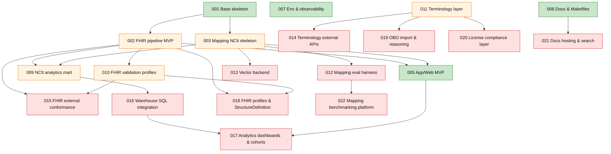

# Roadmap

This roadmap is derived from the kanban epics (001–022).  
Status colors: **Done**, **Review**, **Planned**.

> Legend  
> ✅ Done 🟨 Review / follow‑ups 🕘 Planned

---

## 1) High‑level dependency map



---

## 2) Now / Next / Later (swimlanes)

```mermaid
flowchart LR
  subgraph NOW
    N1[001 Base skeleton ✅]
    N2[002 FHIR pipeline – review items 🟨]
    N3[003 Mapping – review items 🟨]
    N4[005 Web backend & UI ✅]
    N5[007 Env & observability ✅]
    N6[008 Docs & Makefiles – review items 🟨]
    N7[009 Datamart – review items 🟨]
    N8[010 Validation – review items 🟨]
    N9[011 Terminology – review items 🟨]
  end

  subgraph NEXT
    X1[004 CLI app (dfps_cli) 🕘]
    X2[006 Desktop app 🕘]
    X3[013 Vector backend 🕘]
    X4[014 Terminology external APIs 🕘]
    X5[015 External FHIR conformance 🕘]
    X6[021 Docs hosting & search 🕘]
  end

  subgraph LATER
    L1[012 Mapping eval harness 🕘]
    L2[016 Warehouse SQL integration 🕘]
    L3[017 Analytics dashboards & cohorts 🕘]
    L4[018 FHIR profiles & StructureDefinition 🕘]
    L5[019 OBO import & reasoning 🕘]
    L6[020 License compliance layer 🕘]
    L7[022 Benchmarking platform 🕘]
  end
```

---

## 3) Release trains (proposed)

* **v0.1.0 – MVP foundation** *(this PR)*
  001, 002 (core done + review items pending), 003 (core done + review items pending), 005, 007, 008, 009 (doc/tests in place; review items pending), 010 (done; review items pending), 011 (done; review items pending).

* **v0.2.0 – App & external enablement**
  004 (CLI), 006 (Desktop), 013 (Vector backend), 014 (Terminology APIs), 015 (External FHIR validation), 021 (Docs hosting/search).

* **v0.3.0 – Warehouse & analytics**
  016 (SQL integration), 017 (dashboards & cohorts).

* **v0.4.0 – Profiling, reasoning & compliance**
  018 (FHIR profiles/StructureDefinition), 019 (OBO graph import & reasoning), 020 (license compliance).

* **v0.5.0 – Evaluation & benchmarking**
  012 (eval harness), 022 (benchmarking platform, richer metrics & CI gates).

> Version boundaries are guidance; if scope shifts, adjust trains accordingly.

---

## 4) Open work by epic (actionable checklist)

**002 – FHIR pipeline MVP**

* [ ] Validate serde field names (`resourceType`, `type`) & JSON shapes.
* [ ] Check seed determinism across fake‑data + ingestion tests.

**003 – Mapping NCIt skeleton**

* [ ] Cross‑check mock tables cover codes used by `fake_data::raw_fhir`.
* [ ] Verify mapping states align to `docs/system-design/ncit/behavior/state-servicerequest.md`.

**004 – App / CLI MVP**

* [ ] Scaffold `dfps_cli` and expose `run()`.
* [ ] `map-bundles` subcommand (+ `--explain`, `--no-metrics`, `--pretty`).
* [ ] `generate-fhir-bundles` subcommand.
* [ ] Logging + `--help` + README.
* [ ] Directory‑architecture docs & doc‑comment fixes.
* [ ] Integration tests (+ optional CI smoke).

**005 – Web (frontend CI)**

* [ ] Optional: CI step that builds the frontend and runs critical tests.

**006 – Desktop MVP**

* [ ] Shell scaffold; pipeline wiring; minimal UI; export; observability; docs.

**008 – Docs & Makefiles**

* [ ] Confirm `/docs` redirects to `DFPS_DOCS_URL`.
* [ ] Confirm `make` targets succeed on a clean checkout.
* [ ] Optional CI hook: run `cargo make docs` / `cargo make ci`.

**009 – NCIt analytics mart**

* [ ] Confirm dim/fact types match ERD (names/keys/cardinalities).
* [ ] Confirm adding `dfps_datamart` causes no regressions.

**010 – FHIR validation profiles**

* [ ] Ensure requirement IDs are consistently referenced in code & docs.
* [ ] Clarify separation of validation errors vs. ingestion errors.

**011 – Terminology layer**

* [ ] Confirm license tiers/source kinds are modeled correctly for all seeded systems.
* [ ] Ensure mapping behavior remains stable (golden tests hold).
* [ ] Sanity‑check docs vs. actual licensed/unlicensed split & OBO integration points.

**12–22 – Future epics (summaries)**

* **013** Vector backend: `VectorStore` abstraction, concrete backend (pgvector/Qdrant), index builder CLI, engine integration, metrics, runbook.
* **014** Terminology APIs: `TerminologyClient` (+ mock), mapping fallback, env/docs.
* **015** External FHIR conformance: `$validate` client, blending with internal validation, CLI, fixtures.
* **016** Warehouse SQL: DDL/migrations, loader, CLI, integration tests, quickstart.
* **017** Analytics surfaces: backend endpoints, frontend views, BI integration, tests/metrics.
* **018** FHIR profiles: `dfps_fhir_profiles`, profile‑linked validation, fixtures, docs.
* **019** OBO graph: import minimal OBO, reasoning utilities, mapping boosts, fixtures.
* **020** License compliance: policy model, gating, exporters, logs/tests/docs.
* **021** Docs hosting/search: mdBook search, theming, publish pipeline, frontend link.
* **022** Benchmarking platform: multi‑dataset evals, advanced metrics, CI artifacts/dashboards.

---

## 5) How we keep this roadmap fresh

* When a kanban task is checked, update:

  * `CHANGELOG.md` → move items from *Planned* to the next release section.
  * `ROADMAP.md` → update node classes (Done/Review/Planned).
* Gate merges with CI targets already defined in Makefile (`fmt`, `clippy -D warnings`, `test`, `docs`).
