# Mermaid Diagram Gallery

## Flow Pipeline

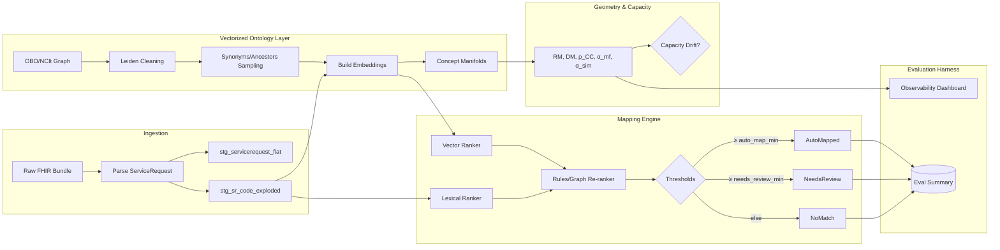

## Class Model

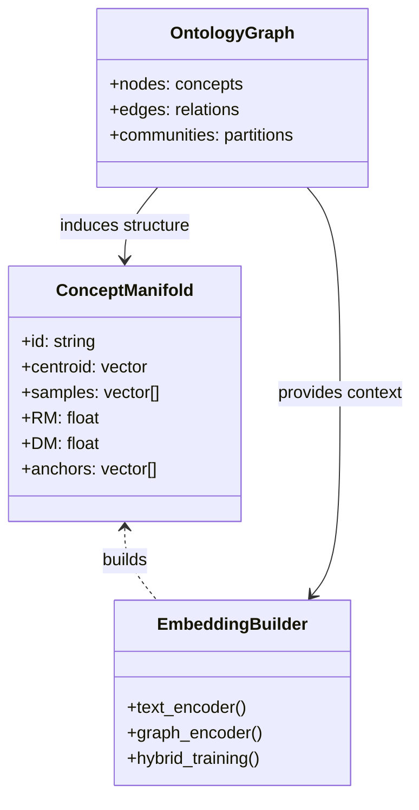

## ER Schema

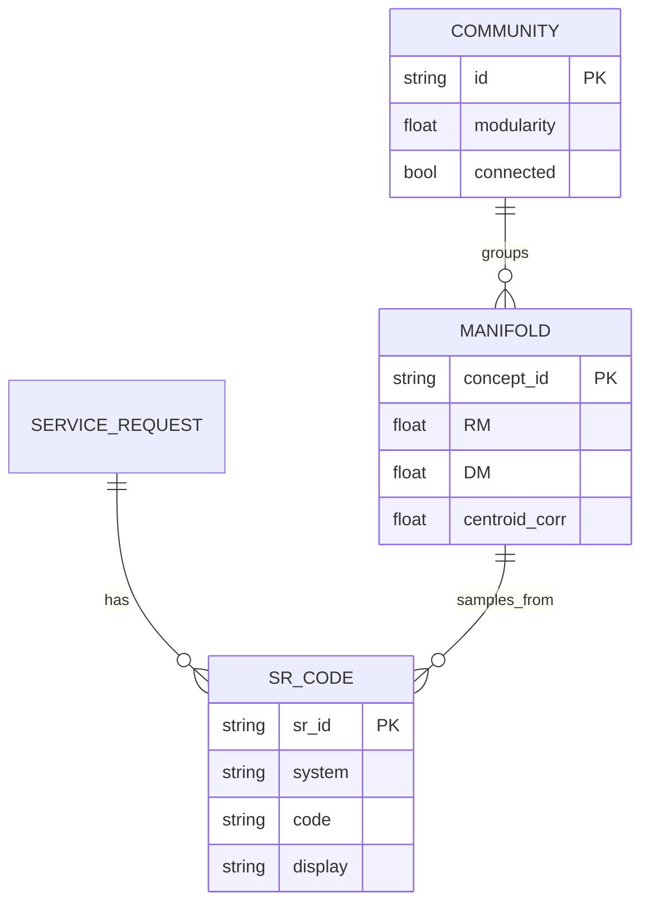

## Sequence Eval

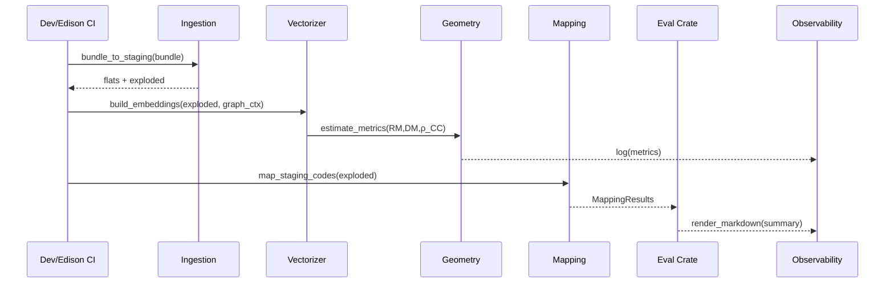

## State Capacity

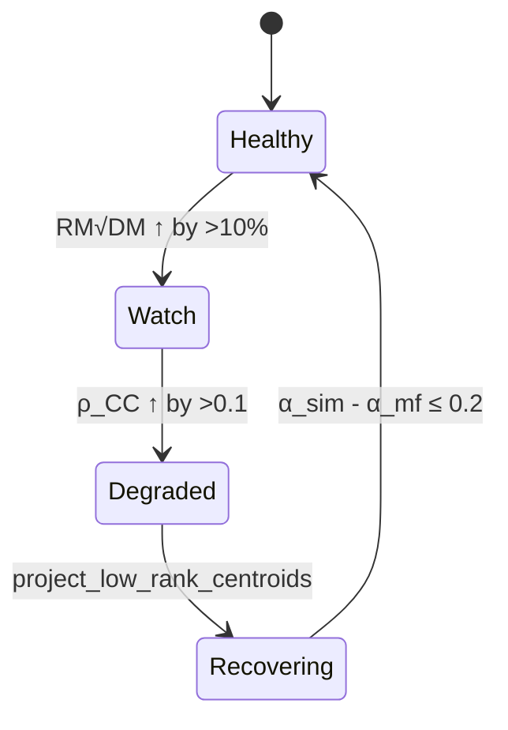

## Gantt Roadmap

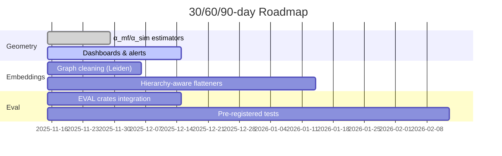

## Journey User

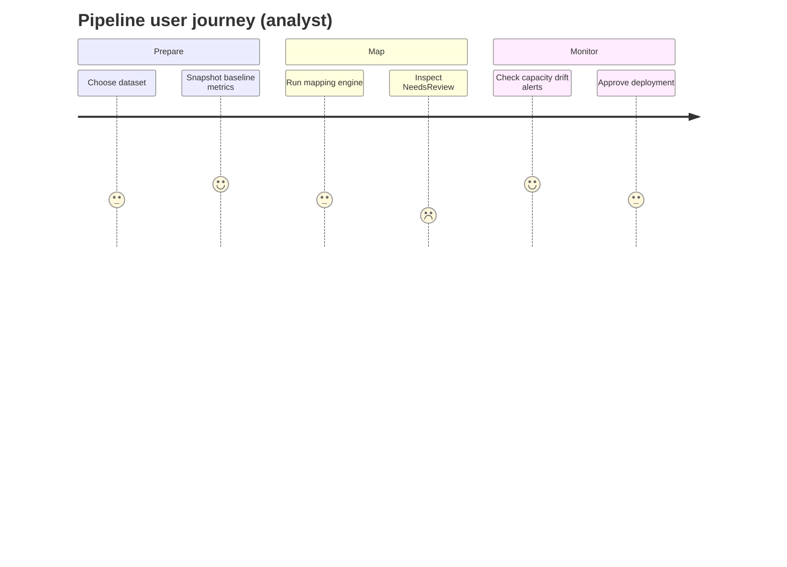

## GitGraph

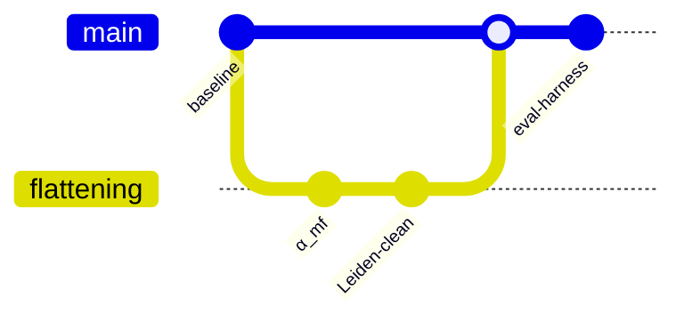

## Pie Metrics

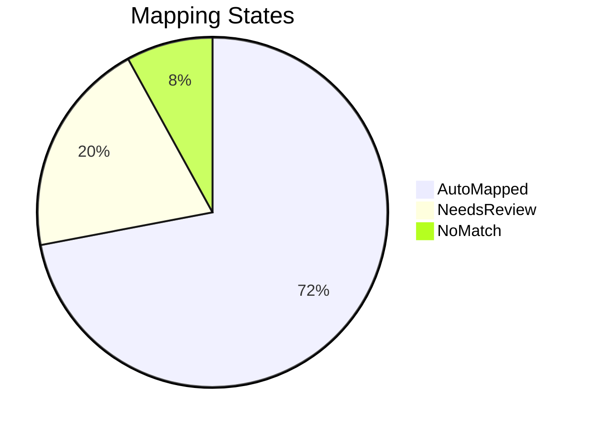

## Flow MMCR

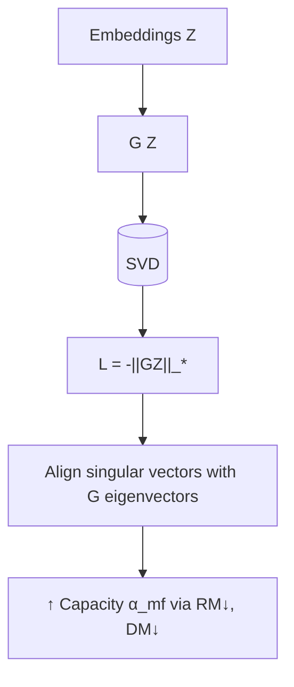

## Flow Correlation

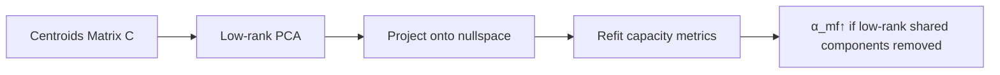

## Flow Graph Health

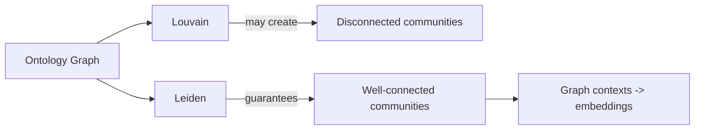
