# I. Executive Summary

**Title:** *A Consortium-of-Minds Inquiry into Manifold Capacity, Geometry, and Vectorized Ontologies*

We connect mean‑field manifold capacity theory to algorithms and controls for a **Vectorized Ontology Layer** that treats NCIt/OBO code systems as joint graph‑and‑vector objects. Classification capacity **α = P/N** depends on **effective manifold radius (R_M)**, **effective dimension (D_M)**, and **centroid correlations (ρ_CC)** measured from **anchor points**; reductions in D_M and R_M and decorrelation of centroids increase α. These quantities admit practical estimators and have been observed to improve across network hierarchies and under explicit **flattening** objectives. [A1, A2, S7, S3]

Operationally, we: (A) build hybrid text+graph embeddings and estimate α via simulation (α_sim) and mean‑field (α_mf) using anchor statistics; (B) use these geometry metrics to predict mapping accuracy and error modes (**AutoMapped / NeedsReview / NoMatch**); (C) enforce graph health with **Leiden** communities to avoid spurious, disconnected clusters that distort geometry; and (D) deliver a repeatable evaluation harness and CI checks. [S4]

**Key levers** (and expected measurable effects): (1) hierarchy‑aware **flattening** (R_M↓, D_M↓ → α↑); (2) removal of low‑rank centroid components (ρ_CC↓ → α↑); (3) community quality via Leiden (connected communities → more stable manifold statistics); and (4) MMCR‑style pretraining that aligns embeddings with task geometry (R_M√D_M ↓). [S7, A2, A1]

We provide formal notes, algorithms with complexity, experiment plans, risk analyses, and a 30/60/90‑day roadmap wired to the DFPS codebase (eval/mapping/pipeline crates). All recommendations include **measurable, testable** criteria and alerts for **capacity drift**, **correlation spikes**, and **community fragmentation**.


# II. Claims Matrix

| Paper | Claim | Formal statement | Evidence strength | Contradicts/extends |
| --- | --- | --- | --- | --- |
| A1 (Nature Comms 2020) | Definition of manifold capacity & anchor points; α=P/N; RM and DM as anchor-derived measures; capacity improves across layers mainly via DM↓ | α_c = P_c/N; weight vector decomposes into anchors; RM = E||anchor||; DM via participation ratio; decreases in D_M dominate α increases | Strong (peer‑reviewed) | Extends MFTMA; basis for all downstream metrics |
| A2 (MMCR 2023) | Inverse capacity α^{-1}=E[F(T)] (support‑function/KKT); MMCR objective aligns Z with G eigenvectors | F(T)=min_V ||V−T||^2 s.t. g_S(V)≥0, with anchors as KKT supports; minimize −||GZ||_* | Strong (arXiv with proofs) | Extends estimators; links learning objective to capacity |
| S7 (JMLR 2024) | Learned flattening reduces curvature while reconstructing signals; improves separability without topological collapse | Curvature‑aware loss + reconstruction; shows class‑separation gains with structure preservation | Strong (peer‑reviewed) | Extends flattening as controllable preprocessor |
| S4 (Leiden 2019) | Leiden guarantees connected communities; Louvain may yield disconnected/badly connected clusters | Iterative refinement converges to partitions without badly connected communities; Louvain may produce disconnected sets | Strong (peer‑reviewed) | Contradicts adequacy of Louvain for capacity‑sensitive graphs |
| S1 (arXiv 2023) | Inductive biases and layer operations shape representation geometry; flattening as a recurring effect | Theoretical/empirical analysis of curvature shaping across blocks | Medium‑strong | Extends intuition for flattening mechanisms |
| S3 (arXiv 2016) | Deep nets progressively linearize/flatten manifolds | Layerwise analysis shows increasing linear separability via flattening | Medium | Supports supervised and unsupervised flattening levers |
| S8 (arXiv 2025) | Latent manifolds approximated by vanishing ideals (algebraic manifolds) | Use polynomial ideals as compact manifold descriptors; algorithms for approximation | Medium‑strong | Extends to algebraic/causal manifold views |
| S9 (arXiv 2017) | Manifold/graph/symmetry unification for non‑Euclidean data | Geometric DL framework and assumptions | Strong (survey) | Background; informs graph‑aware embedding updates |
| S6 (Blog 2018) | Functions‑as‑vectors (Hilbert space) pedagogy | Functions as elements of inner‑product spaces; link to kernels | Weak | Motivational/educational only |

\
# III. Formal Notes (definitions, lemmas, conditions, sketches)

**Definition (Classification / manifold capacity).**
For an ensemble of \(P\) object manifolds in \(\mathbb{R}^N\) with random binary labels, the **capacity** is \(\alpha_c := P_c/N\), where \(P_c\) is the maximal \(P\) such that there exists a hyperplane linearly separating the labeled manifolds. (A1, A2)

**Mean‑field formulation & anchors.**
Let \(\mathcal{S}_\mu\) be the convex hull of manifold \(\mu\). Define the support function \(g_{\mathcal{S}_\mu}(v) = \min_{s\in \mathcal{S}_\mu} v\cdot s\).
Mean‑field theory yields an inverse capacity
\[\alpha^{-1} = \mathbb{E}_{T}[F(T)],\quad F(T) := \min_{V}\|V-T\|^2 \;\text{s.t.}\; g_{\mathcal{S}_\mu}(V) \ge 0 \;\forall \mu,\]
with KKT conditions implying a representation of the separating weight as a sum of **anchor points** \(w = \sum_\mu \lambda_\mu y_\mu \tilde{s}_\mu\), where each \(\tilde{s}_\mu \in \mathcal{S}_\mu\) is the minimizing support for \(\mu\). (A2)

**Effective radius and dimension.**
Write \(\tilde{s}_\mu(T)\) for the anchor associated with random \(T\). Define
\(\displaystyle R_M := \mathbb{E}_T\|\tilde{s}_\mu(T)\|\) and an **effective dimension**
\(\displaystyle D_M := \frac{(\sum_i \lambda_i)^2}{\sum_i \lambda_i^2}\) (participation ratio of the anchor‑projection covariance). Capacity scales inversely with \(R_M\sqrt{D_M}\) under a DM‑ball approximation. (A1, A2)

**Centroid correlation (low‑rank common structure).**
Let \(c_\mu\) be manifold centroids. Define \( \rho_{CC} := \mathbb{E}_{\mu\ne\nu}\cos(c_\mu, c_\nu)\).
If centroids share a rank‑\(K\ll P\) component, projecting onto its nullspace increases effective capacity without altering within‑manifold geometry. (A1)

**Lemma (Sphere / ball approximation).**
For random manifold centers/orientations, replacing each manifold by a \(D_M\)‑dimensional ball of radius \(R_M\) yields \(\alpha_{\text{MFT}} \approx \alpha_{\text{Ball}}(R_M,D_M)\). (A1, A2)

**Curvature and flattening.**
A mapping \(\Phi:\mathbb{R}^N\!\to\!\mathbb{R}^{N'}\) is **flattening** if it decreases manifold curvature while approximately preserving pairwise class topology and centroids; empirical and algorithmic constructions (e.g., FlatNet) reduce \(R_M\) and \(D_M\) and increase separability. (S7, S3)

**Algebraic / causal manifolds.**
If latent manifolds are algebraic sets \(\mathcal{M}=\{x\mid p_j(x)=0\}\), their **vanishing ideal** \(I(\mathcal{M})=\{p: p|_{\mathcal{M}}=0\}\) provides a compact description and supports distance/consistency tests and counterfactual reasoning in structured models. (S8)


\
# IV. Algorithms (pseudocode, complexity, expected effects)

## A1. Capacity estimation from embeddings (α_mf via anchors; α_sim via separability)
**Input:** For each concept \(\mu\), samples \(X_\mu=\{x_{\mu i}\in\mathbb{R}^d\}\).  
**Output:** \(\hat{R}_M, \hat{D}_M, \hat{\alpha}_{\text{mf}}, \hat{\alpha}_{\text{sim}}\).

**Pseudocode (anchor‑based MFTMA):**
```
for each manifold μ:
  c_μ ← mean(X_μ)
  # Solve max-margin over convex hull to get anchor ˜x_μ
  ˜x_μ ← AnchorSolver(X_μ)         # Manifold SVM/KKT on convex hull
  RM_μ ← ||˜x_μ||
  V_μ ← cov(proj_random_dirs_onto_span(˜x_μ))   # anchor projection covariance
  DM_μ ← participation_ratio(V_μ)  # (∑λ)^2 / ∑λ^2
RM ← mean_μ RM_μ ; DM ← mean_μ DM_μ
α_mf ← SphereCapacityApprox(RM, DM)
# α_sim: empirical separability
for N* in decreasing subspace dims of R^d:
  Z ← PCA/project(X_all, N*)
  if linear_SVM_separates(Z manifolds): return α_sim = P / N*
```
**Complexity.** AnchorSolver over \(m_\mu\) points: \(\tilde{O}(m_\mu d^2)\) with modern QP/Frank–Wolfe; SVM grid search for \(\alpha_{\text{sim}}\): \(O(\log d)\) SVM fits.  
**Expected effects.** Tracks \(R_M\sqrt{D_M}\) and \(\rho_{CC}\); decreasing any of these increases \(\alpha\). (A1, A2)

## A2. Hierarchy‑aware flattening / linearization
Use a preprocessor \(\Phi\) with objectives:
- minimize curvature and \(R_M, D_M\) (e.g., FlatNet loss),
- preserve class topology (centroid ordering, nearest‑neighbors).

**Pseudocode:**
```
input: embeddings X, labels (concept IDs), graph context G
repeat until convergence:
  X' ← Encoderθ(X, G)       # text+graph hybrid encoder
  L_flat ← curvature_loss(X') + λ1 * nuclear_norm(G X')    # MMCR term
  L_topo ← triplet_losses_on_centroids(X')
  θ ← θ - η ∇(L_flat + λ2 L_topo)
return Φ(x) = Encoderθ(x, G)
```
**Complexity.** Per step dominated by encoder forward/backward; SVD for nuclear norm on batches.  
**Effect.** \(R_M↓, D_M↓, \rho_{CC}↓\Rightarrow \alpha↑\). (S7, A2)

## A3. Graph‑aware embedding updates (OBO synonyms/ancestors)
Augment each concept manifold by sampling synonyms, definitions, and ancestor‑context templates; learn with contrastive objectives; re‑estimate capacity.

**Pseudocode:**
```
for concept μ:
  S_μ ← {synonyms, preferred name, definition sentences}
  A_μ ← {k-hop ancestor/child labels}
  V_μ ← text_encode(S_μ ⊕ prompts(A_μ))
Update encoder with contrastive InfoNCE on (V_μ, μ)
```
**Effect.** May reduce centroid ambiguity (ρ_CC↓); monitor RM (noisy synonyms can inflate within‑manifold variance). (S9)

## A4. Capacity‑preserving community detection
```
input: ontology graph G=(V,E)
P_leiden ← Leiden(G; resolution γ)
assert all communities connected(P_leiden)   # algorithmic guarantee
use P_leiden to define neighborhood sampling for graph encoder
```
**Effect.** Avoids disconnected “communities” that spuriously break manifolds (RM, DM inflation). (S4)


\
# V. Experiments (design matrix, metrics, thresholds)

## Factors × Levels
- **Curvature / Flattening:** {none, FlatNet, hierarchy‑aware block} (S7, S3)
- **Centroid correlation:** {none, low‑rank projection K=1..5}
- **Graph communities:** {Leiden, Louvain}
- **Embedding regime:** {random init, trained text only, text+graph}
- **Dimensionality \(d\):** {128, 256, 384, 768}
- **Noise:** {clean synonyms, noisy synonyms (p%)}

## Metrics
- \(R_M\), \(D_M\), \(R_M\sqrt{D_M}\), \(\rho_{CC}\); capacities \(\alpha_{\text{mf}}\), \(\alpha_{\text{sim}}\).
- Mapping outcomes: precision/recall/F1; state distribution (AutoMapped/NeedsReview/NoMatch).

## Acceptance thresholds
- **MFT consistency:** \(|\alpha_{\text{sim}}-\alpha_{\text{mf}}|/\alpha_{\text{sim}} \le 0.2\).
- **Capacity gain:** ≥ 10% α increase for new encoders vs. baseline without degradation in precision.
- **Graph health:** disconnected communities < 0.5%; otherwise switch to Leiden.

## Protocols
1) **Synthetic manifolds.** Generate \(D_M\)‑dimensional ellipsoids with controllable \(R_M\), \(D_M\), and centroid correlations; validate \(\alpha_{\text{mf}}\) vs. \(\alpha_{\text{sim}}\).  
2) **Ontology embeddings.** Build per‑concept sample sets from synonyms/definitions; compute metrics pre/post flattening and low‑rank centroid projection.  
3) **Graph health A/B.** Run Louvain vs. Leiden; measure disconnectedness and downstream \(R_M,D_M,\alpha\).  
4) **Ablations.** Remove synonyms or ancestor prompts to quantify their contributions to \(R_M\), \(D_M\), \(\rho_{CC}\).

## Statistical tests
- Paired t‑tests (or Wilcoxon) on \(R_M\), \(D_M\), \(\alpha\) deltas per concept.
- Bootstrap 95% CIs for mapping precision/recall (already available via `dfps_eval` advanced feature).


\
# VI. Graph/Ontology Actions

1. **Prefer Leiden over Louvain** for community detection when defining graph neighborhoods for embedding context. Leiden **guarantees connected communities** and converges under iteration; Louvain can output disconnected/badly connected sets that distort manifold statistics. (S4)
2. **Prune and normalize**: drop dangling/isolated nodes; normalize code‑system URLs to canonical forms before graph construction (see `dfps_terminology::bridge`).
3. **Synonym expansion**: treat synonyms/definitions as samples on each concept manifold; gate low‑quality entries with lexical/semantic filters.
4. **Hierarchy handling**: sample ancestor/child prompts to provide hierarchy‑aware context; measure effect on centroid correlations.
5. **Community‑aware sampling**: when training the graph encoder, sample neighbors within **connected** communities; forbid cross‑community leakage unless edges are explicit “xref/related_to”.


\
# VII. Risk & Red‑Team Findings

- **Mean‑field mismatch.** If \(\alpha_{\text{mf}}\) diverges from \(\alpha_{\text{sim}}\) by >30%, assumptions (random labels, Gaussian correlations) fail. *Mitigation:* default to \(\alpha_{\text{sim}}\); project out low‑rank centroid structure; use robust anchors. (A2)
- **Synonym noise.** Noisy paraphrases inflate \(R_M\). *Mitigation:* synonym quality scoring; roll back if \(R_M\sqrt{D_M}\) ↑ by >20% after update.
- **Graph fragmentation.** Louvain partitions with disconnected communities inflate \(D_M\)/\(R_M\). *Mitigation:* enforce Leiden; audit disconnectedness.
- **Over‑flattening.** Excess flattening collapses class topology. *Mitigation:* add reconstruction/topology terms (as in S7); monitor triplet‑loss violations.
- **License constraints.** Licensed code systems (e.g., CPT) restrict redistribution. *Mitigation:* track license tiers via `dfps_terminology` and mask artifacts accordingly.


\
# VIII. Roadmap & Integration (DFPS crates)

**30 days**
- Implement estimators (`dfps_mapping` or a new `dfps_geometry` crate):
  - Anchor solver, \(R_M\), \(D_M\), \(\alpha_{\text{mf}}\); \(\alpha_{\text{sim}}\) via subspace‑search + SVM.
  - Expose metrics to `dfps_observability` and render via `dfps_eval::report`.
- Graph health: add Leiden pre‑processing before training embeddings.

**60 days**
- Add MMCR option and hierarchy‑aware flattening preprocessor; integrate with mapping engine’s vector ranker; monitor deltas in \(R_M\sqrt{D_M}\), \(\rho_{CC}\), α.

**90 days**
- Full evaluation harness across ontology snapshots; pre‑registered criteria; CI checks that gate deployments on capacity drift/correlation spikes/community disconnectedness.

**Touch points**
- `lib/domain/eval`: extend `EvalSummary` to log geometry stats and α values.
- `lib/domain/mapping`: plug capacity metrics into error analysis; add reasons like `low_capacity_region`.
- `lib/domain/pipeline`: pass geometry telemetry through pipeline output.
- `lib/platform/observability`: dashboard panels for \(R_M\), \(D_M\), \(\rho_{CC}\), α, and alerts.

**CI checks (fail conditions)**
- mean(R_M√D_M) ↑ > 15% vs. baseline; or ρ_CC ↑ > 0.10 absolute; or α_sim ↓ > 10%.


# IX. References


_Seed sources are prioritized; adjacent works included sparingly._

- **[S1]** What Shapes Neural Networks? A Mechanistic Understanding of Handcrafted Inductive Biases (2023). arXiv preprint. https://arxiv.org/pdf/2305.19730 — Discusses inductive biases; includes curvature/flattening perspectives relevant for representation geometry.
- **[S2]** Geometry Linked to Untangling Efficiency Reveals Structure and Computation in Neural Populations (2024/2025). bioRxiv preprint. https://www.biorxiv.org/content/10.1101/2024.02.26.582157v1.full — Introduces simulation- and mean-field capacity (α_sim, α_mf) and anchor/axis measures; GLUE.
- **[S3]** How Deep Nets Flatten and Linearize Representations (2016). arXiv preprint. https://arxiv.org/pdf/1602.04723 — Early formalization of layer-wise linearization/flattening behaviors.
- **[S4]** From Louvain to Leiden: guaranteeing well-connected communities (2019). arXiv / Scientific Reports. https://arxiv.org/abs/1810.08473 — Leiden guarantees connected communities; Louvain may produce disconnected ones.
- **[S5]** Tweet by Peyman Milanfar on manifold capacity & geometry (motivational) (2024). Tweet. https://x.com/docmilanfar/status/1988842744073048553 — Motivational/weak evidence; used only to motivate questions.
- **[S6]** Functions are Vectors (2018). Blog. https://thenumb.at/Functions-are-Vectors/ — Accessible explanation of function spaces and Hilbert spaces; used as pedagogical bridge.
- **[S7]** Representation Learning via Manifold Flattening and Reconstruction (2024). JMLR. https://www.jmlr.org/papers/volume25/23-0615/23-0615.pdf — Pairs flattening with reconstruction to preserve structure; curvature shaping.
- **[S8]** Approximating Latent Manifolds via Vanishing Ideals (2025). arXiv preprint. https://arxiv.org/pdf/2502.15051 — Algebraic manifolds and vanishing ideals as model for latent geometry.
- **[S9]** Geometric Deep Learning: going beyond Euclidean data (2017). arXiv preprint. https://arxiv.org/pdf/1611.08097 — Unifies manifold/graph/symmetry views; background for graphs and manifolds.
- **[S10]** Domínguez-Olmedo et al., PMLR V202 (2023) (2023). PMLR. https://proceedings.mlr.press/v202/dominguez-olmedo23a/dominguez-olmedo23a.pdf — Adjacent method touching manifold distances/structure (referenced sparingly).
- **[A1]** Separability and geometry of object manifolds in deep neural networks (2020). Nature Communications. https://www.nature.com/articles/s41467-020-14578-5 — Core MFTMA definitions: capacity α=P/N, anchor points, effective radius R_M and dimension D_M; empirical layerwise trends.
- **[A2]** Learning Efficient Coding of Natural Images with Maximum Manifold Capacity Representations (2023). arXiv preprint. https://ar5iv.org/html/2303.03307 — MMCR objective; inverse capacity α^{-1} = E[F(T)] support-function/KKT formulation; anchor interpretation.

# Appendix: Mermaid Gallery (inline)

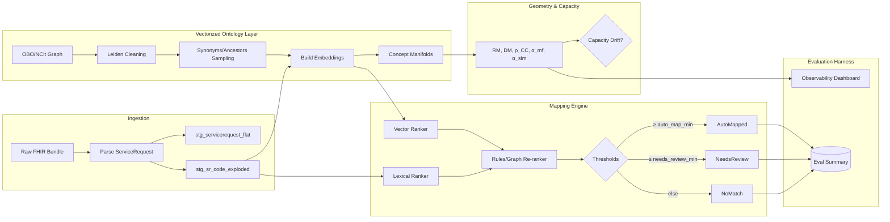

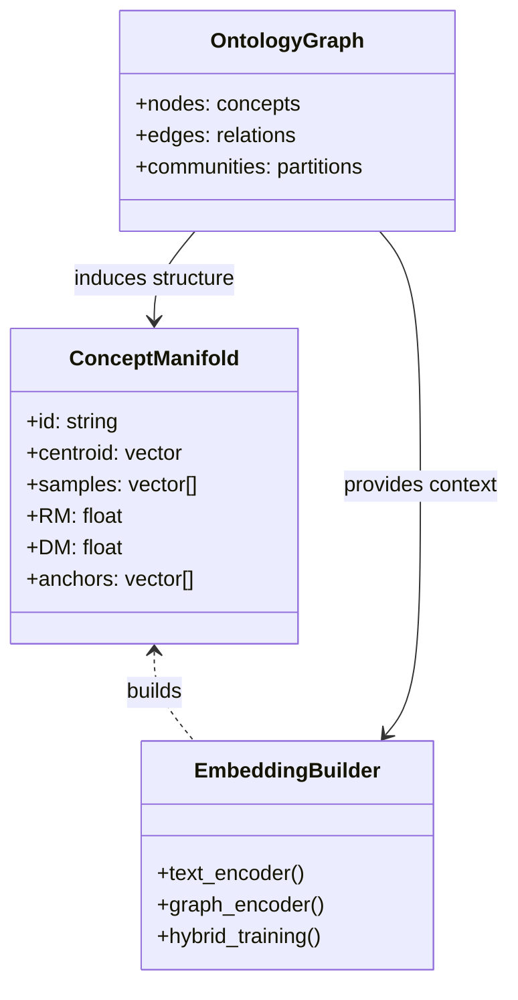

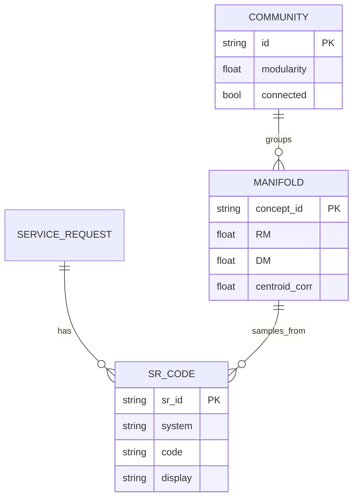

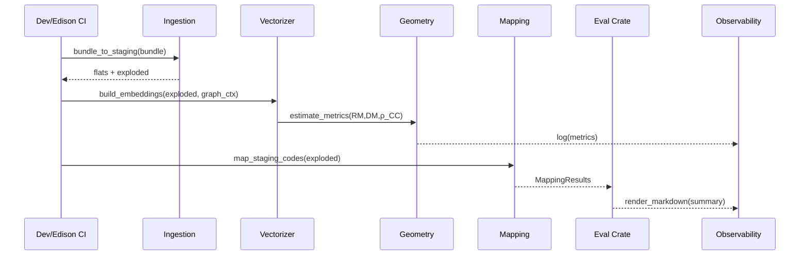

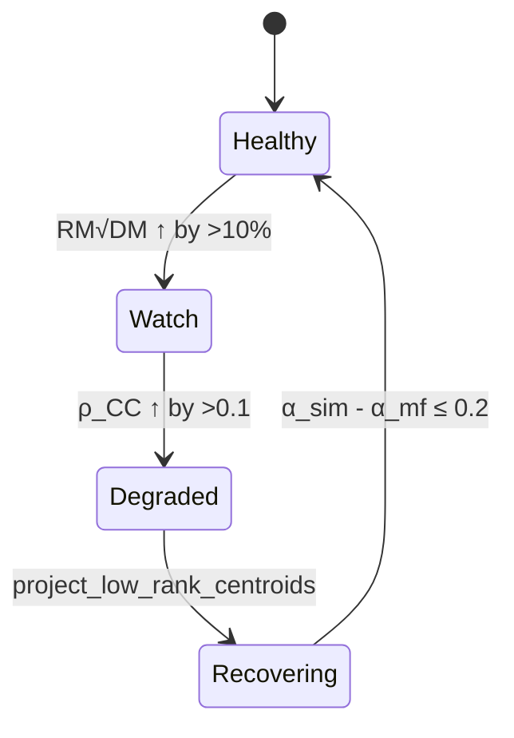

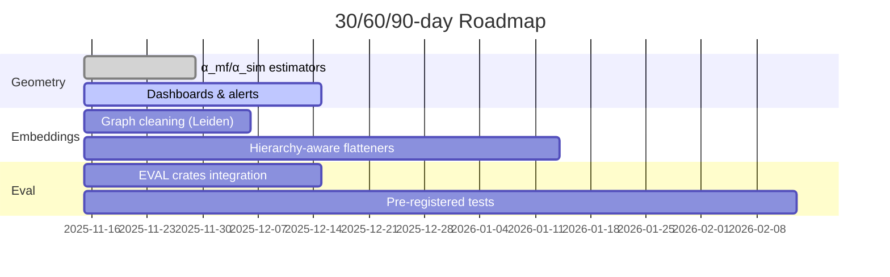

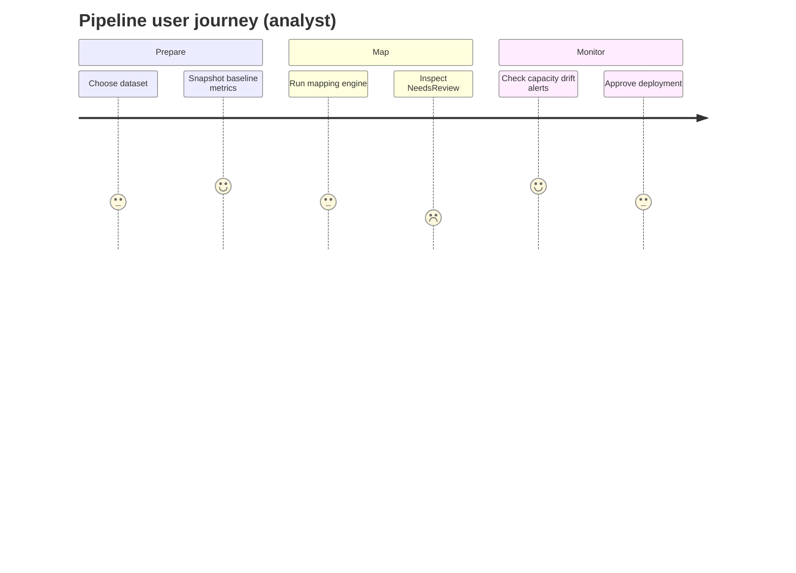

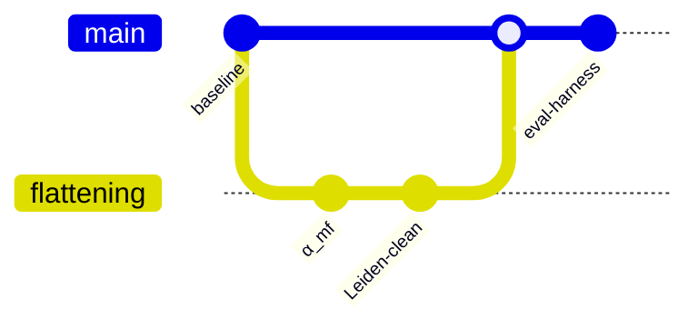

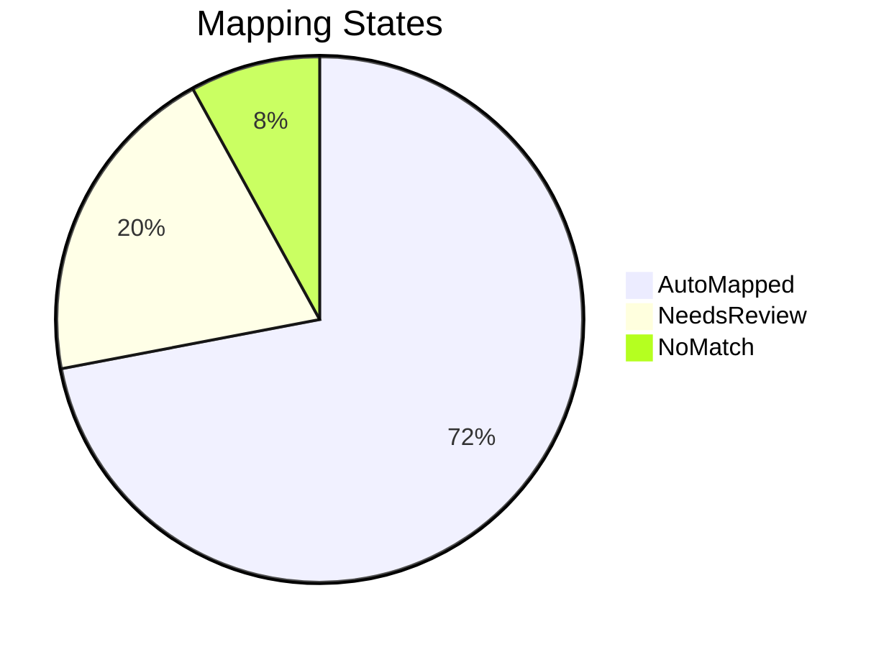

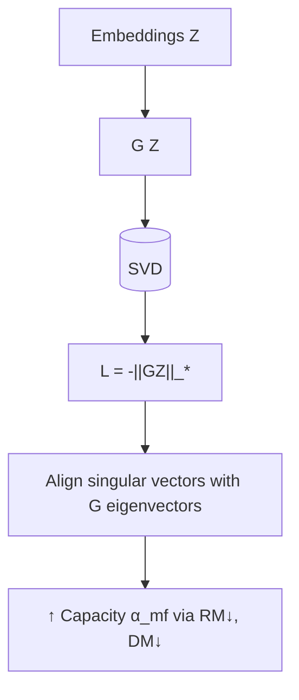


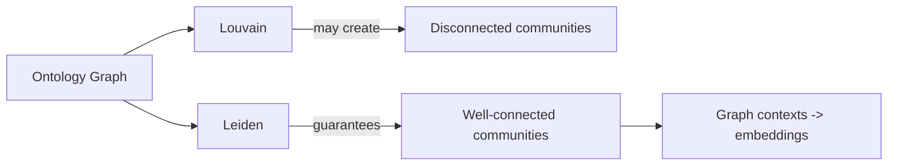