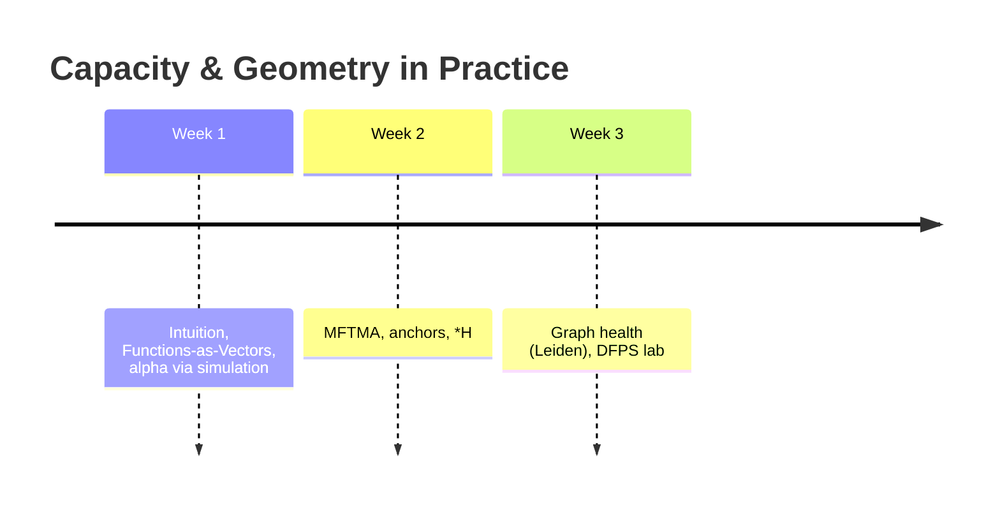

# Academic Bundle - Teaching Module & Reading List
**Date:** 2025-11-15

## 3-week module

**Course timeline**

Terms: 
 - \*H = \(R_M/D_M/rho_CC\)

## Lab
- Implement alpha_sim on toy manifolds; compare to alpha_mf; visualize anchor points.
- Mini-project: add synonym gate and measure W_M change.

## Reading set
- Cohen 2020; Dapello 2021; Yerxa 2023; Traag 2019; Chou 2025; Dominguez-Olmedo 2023.

## References (seed-first, minimal adjacent)

- Cohen, U., Chung, S., Lee, D. D., & Sompolinsky, H. (2020). *Separability and geometry of object manifolds in deep neural networks.* **Nature Communications**. https://www.nature.com/articles/s41467-020-14578-5
- Dapello, J., et al. (2021). *Neural population geometry reveals the role of stochasticity in robust perception.* arXiv:2111.06979. https://ar5iv.org/html/2111.06979
- Yerxa, T., Kuang, X., Simoncelli, E., & Chung, S. (2023). *Learning Efficient Coding of Natural Images with Maximum Manifold Capacity Representations.* arXiv:2303.03307. https://arxiv.org/pdf/2303.03307
- Chou, K.-C., et al. (2025). *Geometry Linked to Untangling Efficiency Reveals Structure and Computation in Neural Populations.* bioRxiv:2024.02.26.582157. https://www.biorxiv.org/content/10.1101/2024.02.26.582157v1
- Traag, V. A., Waltman, L., & van Eck, N. J. (2019). *From Louvain to Leiden: guaranteeing well-connected communities.* arXiv:1810.08473. https://arxiv.org/pdf/1810.08473
- Dominguez-Olmedo, A., et al. (2023). *The geometry of concept manifolds.* JMLR 25(62). https://www.jmlr.org/papers/volume25/23-0615/23-0615.pdf
- Primer (weak evidence): *Functions are Vectors.* https://thenumb.at/Functions-are-Vectors/
