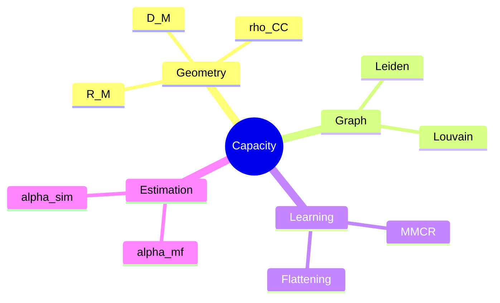

# Doctoral Bundle - Open Problems & Thesis Arcs
**Date:** 2025-11-15

## Thesis-worthy directions
1. Tight finite-sample bounds relating W_M to alpha beyond ball approximation.
2. Graph-aware manifold theory: capacity under structured centroid correlations induced by ontologies.
3. Learning objectives: provably capacity-maximizing regularizers (MMCR variants with constraints).

## Candidate papers (3-pack)
- Theory: bounds for alpha under anisotropic manifolds; concentration on anchors.
- Method: scalable anchor estimation + debiasing of rho_CC.
- Application: ontology-mapping system with formal safety guarantees.

**Concept map**

## Evaluation norms
- Reproduce layerwise geometry trends.
- Report alpha gaps; justify deviations via non-sphericity diagnostics.
- Release code/data splits.

## References (seed-first, minimal adjacent)

- Cohen, U., Chung, S., Lee, D. D., & Sompolinsky, H. (2020). *Separability and geometry of object manifolds in deep neural networks.* **Nature Communications**. https://www.nature.com/articles/s41467-020-14578-5
- Dapello, J., et al. (2021). *Neural population geometry reveals the role of stochasticity in robust perception.* arXiv:2111.06979. https://ar5iv.org/html/2111.06979
- Yerxa, T., Kuang, X., Simoncelli, E., & Chung, S. (2023). *Learning Efficient Coding of Natural Images with Maximum Manifold Capacity Representations.* arXiv:2303.03307. https://arxiv.org/pdf/2303.03307
- Chou, K.-C., et al. (2025). *Geometry Linked to Untangling Efficiency Reveals Structure and Computation in Neural Populations.* bioRxiv:2024.02.26.582157. https://www.biorxiv.org/content/10.1101/2024.02.26.582157v1
- Traag, V. A., Waltman, L., & van Eck, N. J. (2019). *From Louvain to Leiden: guaranteeing well-connected communities.* arXiv:1810.08473. https://arxiv.org/pdf/1810.08473
- Dominguez-Olmedo, A., et al. (2023). *The geometry of concept manifolds.* JMLR 25(62). https://www.jmlr.org/papers/volume25/23-0615/23-0615.pdf
- Primer (weak evidence): *Functions are Vectors.* https://thenumb.at/Functions-are-Vectors/
