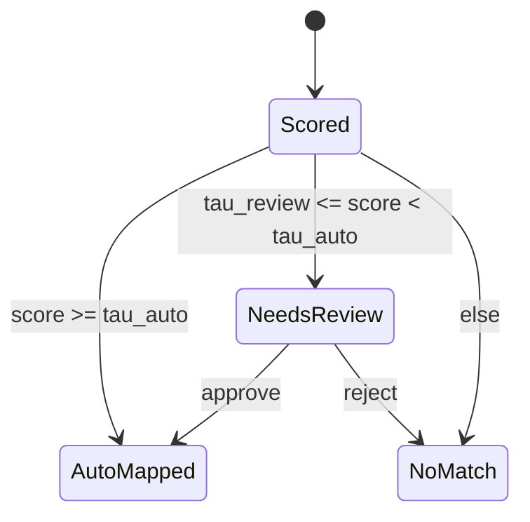
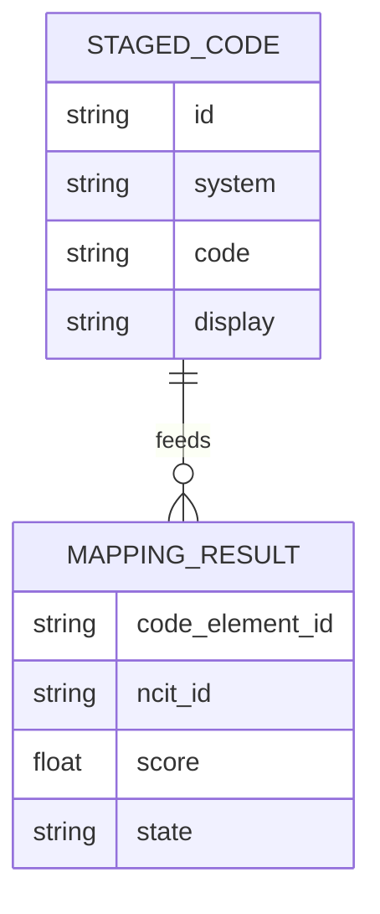

# Engineering Bundle - Vectorized Ontology & Manifold Geometry
**Date:** 2025-11-15  
**Audience:** Backend/data/infra engineers implementing DFPS features.

## What to build (overview)
- **Geometry probes**: compute (R_M, D_M, rho_CC, alpha_mf, alpha_sim) on every mapping batch; emit to logs + reports.
- **Vectorized Ontology Layer**: unify graph (NCIt/OBO) + text embeddings; provide synonym-gated sampling.
- **Graph health**: run Leiden; block disconnected communities in sampling; enforce CI checks.
- **Mapping states**: AutoMapped / NeedsReview / NoMatch tied to geometry signals.

## DFPS Integration Points
- `lib/domain/mapping/src/lib.rs`: hook a `geometry_probe()` after candidates are ranked; attach `reason` tags e.g., `capacity_low`, `centroid_corr_high`.
- `lib/domain/eval/src/lib.rs` & `report.rs`: extend `EvalSummary` with `geometry: Option<GeometryStats>`.
- `lib/domain/terminology`: add Leiden pass and connectivity audit before embedding updates.
- `lib/domain/pipeline`: surface metrics to observability.

## API sketch (Rust)
```rust
pub struct GeometryStats {{
    pub r_m: f32,
    pub d_m: f32,
    pub rho_cc: f32,
    pub alpha_mf: f32,
    pub alpha_sim: f32,
}}

pub fn geometry_probe(samples: &HashMap<ConceptId, Vec<Vec<f32>>>) -> GeometryStats {{
    // anchors via convex-hull SVM (approximate), participation ratio for D_M, etc.
}}
```

## KPIs & SLOs
- Latency overhead per batch <= 10%.
- Capacity sanity: |alpha_sim - alpha_mf| / alpha_sim <= 0.2 (alert above).
- Disconnected communities <= 0.5% (block merge otherwise).
- Mapping precision/recall non-degrading when W_M = R_M * sqrt(D_M) is improved.

## Examples
- Synonym gate: adding noisy synonyms raised R_M 28% -> alpha dropped; revert synonyms and re-embed.
- Centroid projection: remove top-k centroid PCs to lower rho_CC, improving alpha 10-15% with no recall loss.


**System flow (DFPS + geometry taps)**
```mermaid
flowchart LR
  A[Staged Codes] --> B[Candidate Generation]
  B --> C[Ranking]
  C --> D{{geometry_probe}}
  D -->|alpha,R_M,D_M,rho_CC| E[Eval + Report]
  E --> F[CI/Alerts]
  B -. graph ctx .-> G[Ontology Graph (Leiden)]
  G --> B
```

**Mapping state machine**


**Data model (simplified)**


## References (seed-first, minimal adjacent)

- Cohen, U., Chung, S., Lee, D. D., & Sompolinsky, H. (2020). *Separability and geometry of object manifolds in deep neural networks.* **Nature Communications**. https://www.nature.com/articles/s41467-020-14578-5
- Dapello, J., et al. (2021). *Neural population geometry reveals the role of stochasticity in robust perception.* arXiv:2111.06979. https://ar5iv.org/html/2111.06979
- Yerxa, T., Kuang, X., Simoncelli, E., & Chung, S. (2023). *Learning Efficient Coding of Natural Images with Maximum Manifold Capacity Representations.* arXiv:2303.03307. https://arxiv.org/pdf/2303.03307
- Chou, K.-C., et al. (2025). *Geometry Linked to Untangling Efficiency Reveals Structure and Computation in Neural Populations.* bioRxiv:2024.02.26.582157. https://www.biorxiv.org/content/10.1101/2024.02.26.582157v1
- Traag, V. A., Waltman, L., & van Eck, N. J. (2019). *From Louvain to Leiden: guaranteeing well-connected communities.* arXiv:1810.08473. https://arxiv.org/pdf/1810.08473
- Dominguez-Olmedo, A., et al. (2023). *The geometry of concept manifolds.* JMLR 25(62). https://www.jmlr.org/papers/volume25/23-0615/23-0615.pdf
- Primer (weak evidence): *Functions are Vectors.* https://thenumb.at/Functions-are-Vectors/
