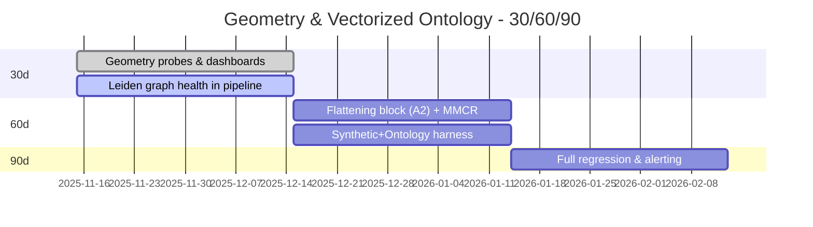

# Leadership Bundle - Outcomes, Risk, and Timeline
**Date:** 2025-11-15  
**Audience:** Execs, product leads, program management.

## Why this matters
- Mapping accuracy & safety: geometry-aware scoring reduces false AutoMapped and funnels edge cases to review.
- Observability: capacity/geometry metrics create early-warning signals for drift before accuracy drops.
- Graph governance: Leiden prevents structural pathologies that silently degrade quality.

## Success metrics (quarter)
- F1: +2-5% on ontology mapping benchmarks.
- NeedsReview triage: -20% reviewer load at same precision.
- Drift SLA: Alert < 24h when |alpha_sim - alpha_mf| / alpha_sim > 0.2.
- Graph health: disconnected communities <= 0.5%.

**Roadmap**

## Risk register
- Mean-field mismatch (modeling assumption) -> mitigated by alpha_sim cross-check.
- Synonym noise inflates R_M -> gating & rollback.
- Community fragmentation -> use Leiden by default; block merges when connectivity fails.

## Investment & ROI
- Small engineering uplift (2-4 wks) for probes + metrics.
- Medium uplift (4-6 wks) for flattening/MMCR.
- Expected net: improved safety and throughput; earlier detection saves review time and avoids incidents.

## References (seed-first, minimal adjacent)

- Cohen, U., Chung, S., Lee, D. D., & Sompolinsky, H. (2020). *Separability and geometry of object manifolds in deep neural networks.* **Nature Communications**. https://www.nature.com/articles/s41467-020-14578-5
- Dapello, J., et al. (2021). *Neural population geometry reveals the role of stochasticity in robust perception.* arXiv:2111.06979. https://ar5iv.org/html/2111.06979
- Yerxa, T., Kuang, X., Simoncelli, E., & Chung, S. (2023). *Learning Efficient Coding of Natural Images with Maximum Manifold Capacity Representations.* arXiv:2303.03307. https://arxiv.org/pdf/2303.03307
- Chou, K.-C., et al. (2025). *Geometry Linked to Untangling Efficiency Reveals Structure and Computation in Neural Populations.* bioRxiv:2024.02.26.582157. https://www.biorxiv.org/content/10.1101/2024.02.26.582157v1
- Traag, V. A., Waltman, L., & van Eck, N. J. (2019). *From Louvain to Leiden: guaranteeing well-connected communities.* arXiv:1810.08473. https://arxiv.org/pdf/1810.08473
- Dominguez-Olmedo, A., et al. (2023). *The geometry of concept manifolds.* JMLR 25(62). https://www.jmlr.org/papers/volume25/23-0615/23-0615.pdf
- Primer (weak evidence): *Functions are Vectors.* https://thenumb.at/Functions-are-Vectors/
