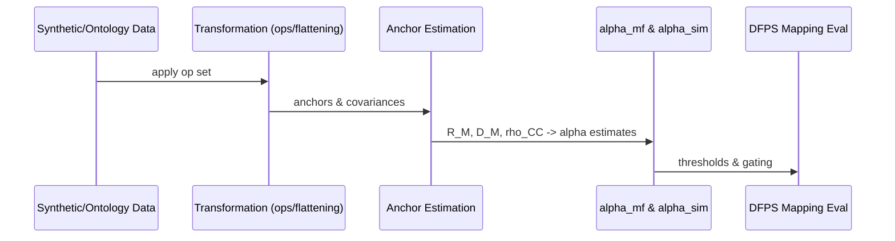
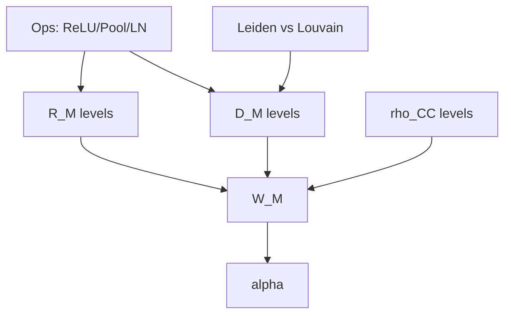

# Research Bundle - Capacity, Geometry, & Evaluation
**Date:** 2025-11-15  
**Audience:** ML/neuro/IR researchers.

## Core questions
- How do layerwise ops (LN/ReLU/pooling) change D_M, R_M, rho_CC and capacity alpha?
- When do mean-field estimates (alpha_mf) break from simulation (alpha_sim)?
- What graph interventions (Leiden; synonym gates) preserve/improve W_M = R_M*sqrt(D_M)?

## Methods (concise)
- MFTMA: anchors/KKT; alpha^{-1} = E_T[F(T)]; ball approximation for W_M.  
- MMCR: nuclear-norm objective L = -||GZ||_* to align to high capacity.  
- Graph health: Leiden connectivity guarantees.

## Design matrix
- Factors: R_M in [0.1..0.5], D_M in {4,8,16,32}, rho_CC in {0,0.05,0.1,0.2}; ops in {ReLU, Pool, LN}; graph in {Leiden,Louvain}.
- Datasets: synthetic ellipsoids; ontology slices (NCIt/OBO) with synonym expansions.

## Metrics
- Geometry: R_M, D_M, rho_CC, W_M.
- Capacity: alpha_mf, alpha_sim.
- Downstream: mapping F1 / NeedsReview rate.

## Analysis plan
- Report layerwise slopes: Delta D_M, Delta R_M, Delta rho_CC vs Delta alpha.
- Gap analysis: flag |alpha_sim - alpha_mf| / alpha_sim > 0.2; inspect manifold non-sphericity.
- Graph ablation: Leiden vs Louvain impact on disconnected% and D_M.

**Experiment pipeline**

**Factor grid (illustrative)**

## References (seed-first, minimal adjacent)

- Cohen, U., Chung, S., Lee, D. D., & Sompolinsky, H. (2020). *Separability and geometry of object manifolds in deep neural networks.* **Nature Communications**. https://www.nature.com/articles/s41467-020-14578-5
- Dapello, J., et al. (2021). *Neural population geometry reveals the role of stochasticity in robust perception.* arXiv:2111.06979. https://ar5iv.org/html/2111.06979
- Yerxa, T., Kuang, X., Simoncelli, E., & Chung, S. (2023). *Learning Efficient Coding of Natural Images with Maximum Manifold Capacity Representations.* arXiv:2303.03307. https://arxiv.org/pdf/2303.03307
- Chou, K.-C., et al. (2025). *Geometry Linked to Untangling Efficiency Reveals Structure and Computation in Neural Populations.* bioRxiv:2024.02.26.582157. https://www.biorxiv.org/content/10.1101/2024.02.26.582157v1
- Traag, V. A., Waltman, L., & van Eck, N. J. (2019). *From Louvain to Leiden: guaranteeing well-connected communities.* arXiv:1810.08473. https://arxiv.org/pdf/1810.08473
- Dominguez-Olmedo, A., et al. (2023). *The geometry of concept manifolds.* JMLR 25(62). https://www.jmlr.org/papers/volume25/23-0615/23-0615.pdf
- Primer (weak evidence): *Functions are Vectors.* https://thenumb.at/Functions-are-Vectors/
