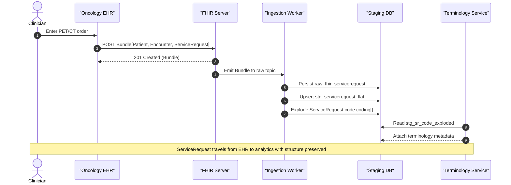

# FHIR ServiceRequest end-to-end sequence

**Related diagrams**

- [System architecture](../architecture/system-architecture.md)
- [ServiceRequest state lifecycle](./state-servicerequest.md)
- [Ingestion ER model](../models/data-model-er.md)
- [Pipeline mindmap](../concepts/mindmap-pipeline.md)