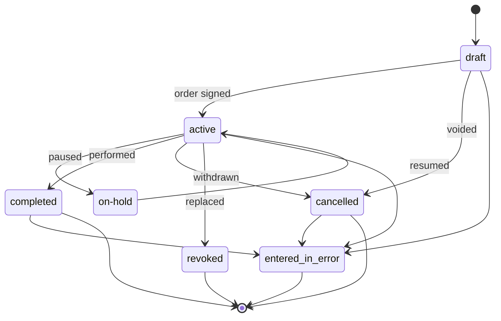

# ServiceRequest status lifecycle

---

**Related diagrams**

- [ServiceRequest sequence](./sequence-servicerequest.md)
- [System architecture](../architecture/system-architecture.md)
- [FHIR class model](../models/class-model.md)
