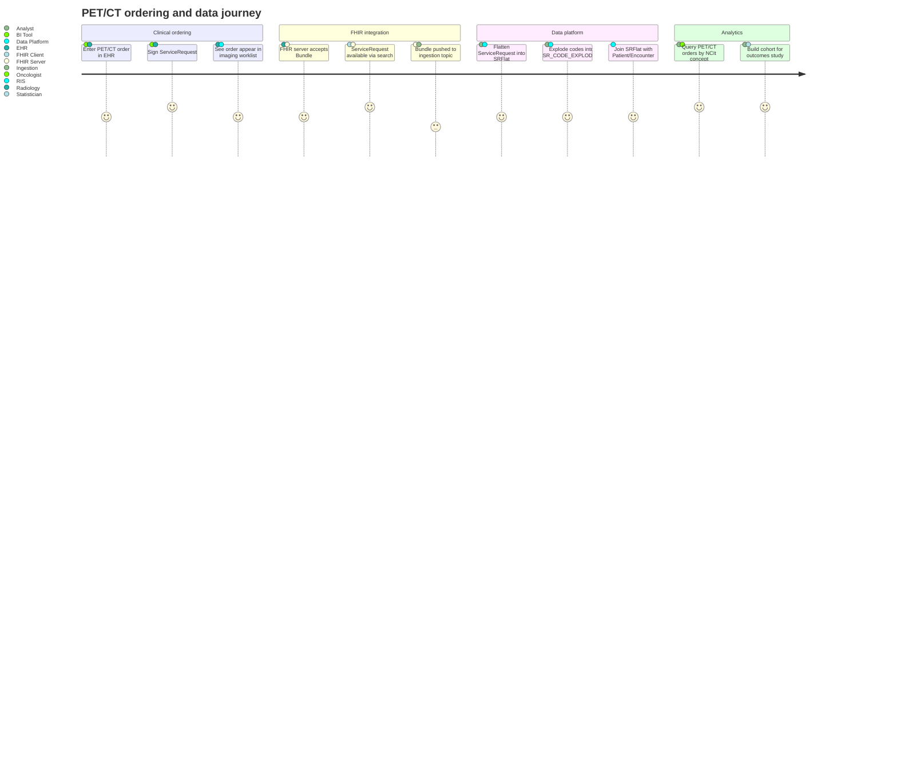

# User journey: ordering & analyzing a PET/CT

---

**Related diagrams**

- [System architecture](../architecture/system-architecture.md)
- [ServiceRequest sequence](../behavior/sequence-servicerequest.md)
- [Pipeline mindmap](../concepts/mindmap-pipeline.md)
