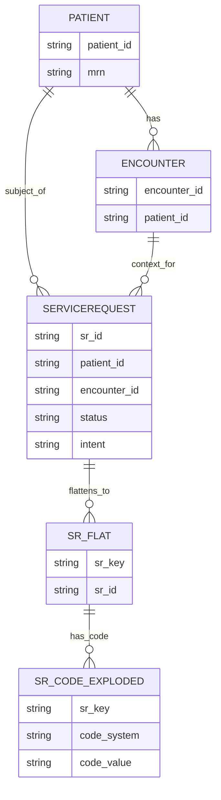

# FHIR -> staging entity-relationship view

---

**Related diagrams**

- [System architecture](../architecture/system-architecture.md)
- [FHIR class model](./class-model.md)
- [ServiceRequest sequence](../behavior/sequence-servicerequest.md)
- [PET/CT user journey](../experience/user-journey-pet-ct.md)
