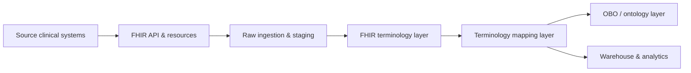

# FHIR slice overview

---

DFPS treats the "FHIR terminology layer" node above as a license-aware registry: `dfps_terminology::bridge::EnrichedCode` normalises system URLs, labels each code as licensed/open/OBO, and hands that metadata to `dfps_mapping`. CLI flows such as `map_codes` use `map_staging_codes_with_summary` to print counts by `CodeKind` so humans immediately see how many codes were missing identifiers or referenced licensed systems.

**Related diagrams**

* [System architecture](./architecture/system-architecture.md)
* [FHIR class model](./models/class-model.md)
* [Ingestion ER model](./models/data-model-er.md)
* [ServiceRequest sequence](./behavior/sequence-servicerequest.md)
* [Ingestion requirements](./requirements/ingestion-requirements.md)
* [Terminology layer](./concepts/terminology-layer.md)

