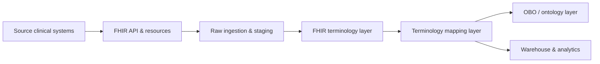

# FHIR slice overview

--- 

**Related diagrams**

* [System architecture](./architecture/system-architecture.md)
* [FHIR class model](./models/class-model.md)
* [Ingestion ER model](./models/data-model-er.md)
* [ServiceRequest sequence](./behavior/sequence-servicerequest.md)
* [Ingestion requirements](./requirements/ingestion-requirements.md)
