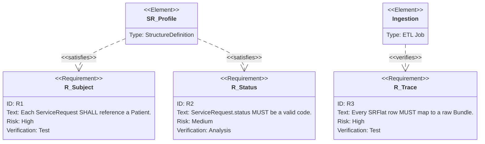

## Verification linkage

The `dfps_ingestion::validation` module enforces these requirements via the
`validate_sr` helper:

- `RequirementRef::RSubject` → `VAL_SR_SUBJECT_*` issues ensure every ServiceRequest carries a `Patient/<id>` subject reference.
- `RequirementRef::RStatus` → `VAL_SR_STATUS_*` issues ensure statuses normalize to the supported vocabulary (`active`, `draft`, etc.).
- `RequirementRef::RTrace` → `VAL_SR_TRACE_*` issues ensure stable identifiers (e.g., `ServiceRequest.id`) are present so staging rows can be traced back to source Bundles.

Downstream callers can inspect each `ValidationIssue`'s `requirement_ref()` to
tie failures directly to the diagram IDs above.
