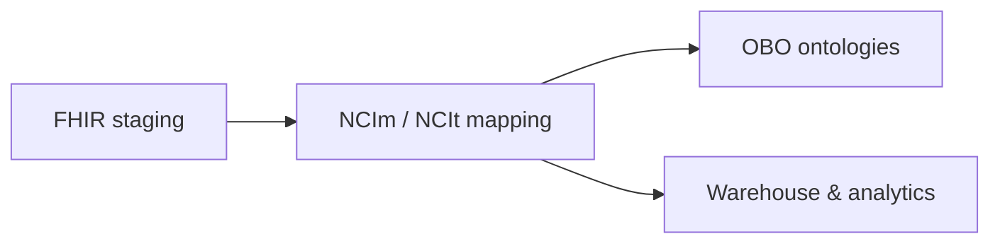
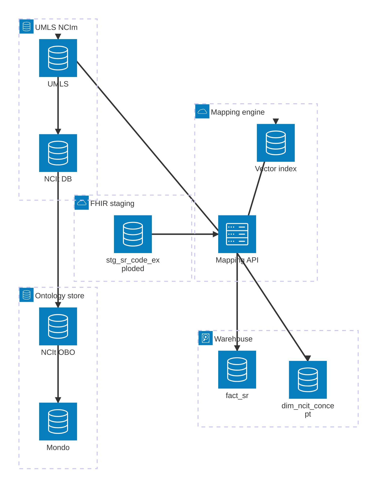

# NCIm / NCIt Mapping & Analytics Architecture

## Legend

- (Square nodes): entities/tables
- (Rounded nodes): services/processes
- Subgraphs: layers (Staging, Mapping, UMLS/NCIm, OBO, Warehouse)

## High-level mapping pipeline

## Architecture (mapping platform)

## Implementation layers

- **Domain crates**
  - `lib/domain/ingestion` (`dfps_ingestion`) : emits `stg_sr_code_exploded` rows.
  - `lib/domain/mapping` (`dfps_mapping`) : lexical/vector rankers, rule rerankers, `MappingEngine`, plus the license-aware `map_staging_codes_with_summary` helper that produces `MappingSummary`. The crate also exports `dfps_mapping::eval::{EvalCase, EvalResult, EvalSummary, run_eval}` which consumes the gold fixtures and reports precision/recall + per-state counts.
  - `lib/domain/pipeline` (`dfps_pipeline`) : composes ingestion + mapping via `bundle_to_mapped_sr`.
  - `lib/domain/terminology` (`dfps_terminology`) -?" license-aware CodeSystem/ValueSet registries plus staging-code enrichment.
- **Platform crates**
  - `lib/platform/observability` : metrics/log helpers used by the CLI and tests.
  - `lib/platform/test_suite` : regression/property tests and fixtures, plus the evaluation harness tests (`tests/integration/mapping_eval.rs`) that keep `run_eval` wired to the gold datasets.
- **Warehouse bridge**
  - `lib/app/web/backend/datamart` (`dfps_datamart`) -?" turns `bundle_to_mapped_sr` output into the dimensional mart (`DimPatient`, `DimEncounter`, `DimCode`, `DimNCIT`, `FactServiceRequest`) and maintains the sentinel `DimNCIT` row that collects `NoMatch` facts.
- **App surfaces**
  - `lib/app/cli` : `map_bundles` streams Bundles → staging/mapping rows; `map_codes` explains staged codes; `eval_mapping` reads gold NDJSON and prints precision/recall + state counts via `dfps_mapping::eval::run_eval`.

## Mapping states & thresholds

| State        | Condition                                  | Action                                             |
|--------------|--------------------------------------------|----------------------------------------------------|
| AutoMapped   | Score >= 0.95 (default)                     | Persist & link to NCIt without manual review       |
| NeedsReview  | 0.60 >= score < 0.95                        | Surface to curation queue                          |
| NoMatch      | Score < 0.60 or missing identifiers        | Track with `reason` + provenance for later triage  |

- Thresholds live in `dfps_core::mapping::MappingThresholds`; defaults are surfaced in `MappingResult`.
- `MappingResult.reason` explains whether a NoMatch came from missing data, low scores, or rule filters.
- `map_bundles --log-level info …` logs aggregated metrics (`auto_mapped`, `needs_review`, `no_match`) via `dfps_observability`.
## Terminology instrumentation

- `dfps_terminology::bridge::EnrichedCode` normalises system URLs, classifies codes into a `CodeKind`, and hands license/source metadata to `dfps_mapping`.
- Every `MappingResult` includes `license_tier` / `source_kind`; NoMatch rows specify whether identifiers were missing or the system was unknown.
- `dfps_mapping::MappingSummary` tallies counts by `CodeKind` and license tier; `map_staging_codes_with_summary` (used by `map_codes`) prints those tallies for quick observability.
