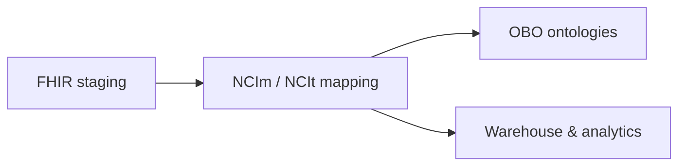
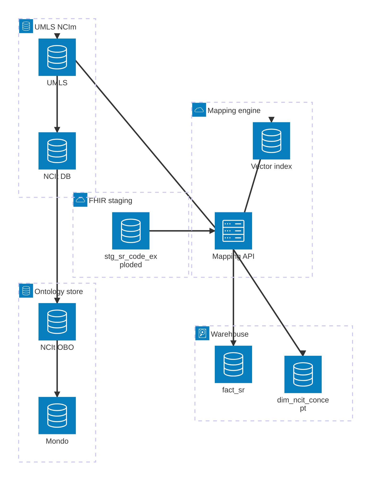

# NCIm / NCIt Mapping & Analytics Architecture

## Legend

- [Square nodes] – entities/tables
- (Rounded nodes) – services/processes
- Subgraphs – layers (Staging, Mapping, UMLS/NCIm, OBO, Warehouse)

## High-level mapping pipeline

## Architecture (mapping platform)

## Implementation layers

- **Domain crates**
  - `lib/domain/ingestion` (`dfps_ingestion`) — emits `stg_sr_code_exploded` rows.
  - `lib/domain/mapping` (`dfps_mapping`) — lexical/vector rankers, rule rerankers, and `MappingEngine`.
  - `lib/domain/pipeline` (`dfps_pipeline`) — composes ingestion + mapping via `bundle_to_mapped_sr`.
- **Platform crates**
  - `lib/platform/observability` — metrics/log helpers used by the CLI and tests.
  - `lib/platform/test_suite` — regression/property tests and fixtures.
- **App surfaces**
  - `lib/app/cli` — `map_bundles` streams Bundles → staging/mapping rows; `map_codes` explains staged codes.

## Mapping states & thresholds

| State        | Condition                                  | Action                                             |
|--------------|--------------------------------------------|----------------------------------------------------|
| AutoMapped   | Score ≥ 0.95 (default)                     | Persist & link to NCIt without manual review       |
| NeedsReview  | 0.60 ≤ score < 0.95                        | Surface to curation queue                          |
| NoMatch      | Score < 0.60 or missing identifiers        | Track with `reason` + provenance for later triage  |

- Thresholds live in `dfps_core::mapping::MappingThresholds`; defaults are surfaced in `MappingResult`.
- `MappingResult.reason` explains whether a NoMatch came from missing data, low scores, or rule filters.
- `map_bundles --log-level info …` logs aggregated metrics (`auto_mapped`, `needs_review`, `no_match`) via `dfps_observability`.
