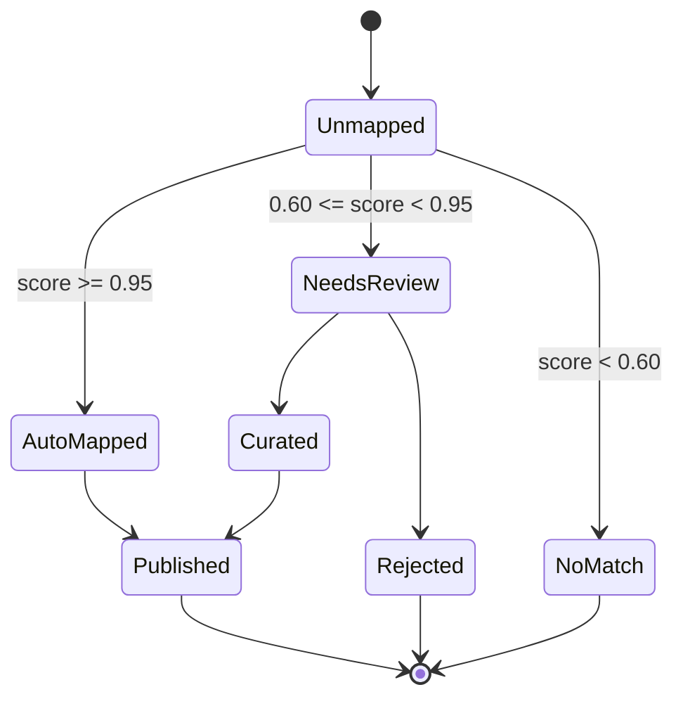

# State machine: lifecycle of a code -> NCIt mapping

```mermaid
stateDiagram-v2
  [*] --> Unmapped

  Unmapped --> AutoMapped: score >= 0.95
  Unmapped --> NeedsReview: 0.60 <= score < 0.95
  Unmapped --> NoMatch: score < 0.60

  AutoMapped --> Published
  NeedsReview --> Curated
  NeedsReview --> Rejected

  Curated --> Published

  Published --> [*]
  NoMatch --> [*]
  Rejected --> [*]
```
