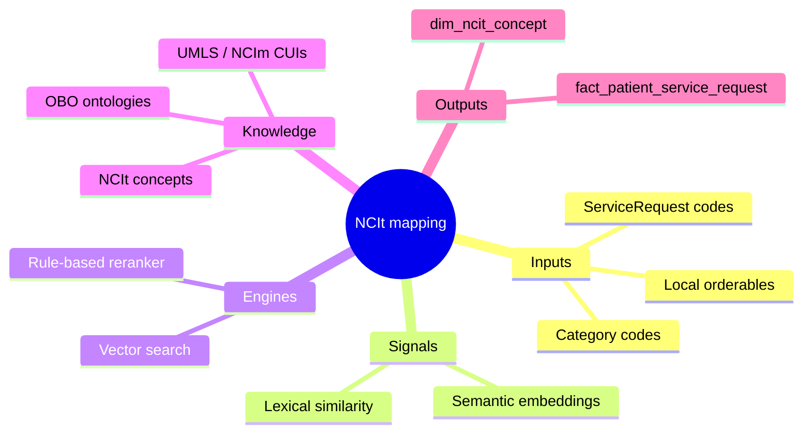

# Mindmap: NCIt mapping strategy

```mermaid
mindmap
  root((NCIt mapping))
    Inputs
      ServiceRequest codes
      Category codes
      Local orderables
    Signals
      Lexical similarity
      Semantic embeddings
    Engines
      Vector search
      Rule-based reranker
    Knowledge
      UMLS / NCIm CUIs
      NCIt concepts
      OBO ontologies
    Outputs
      dim_ncit_concept
      fact_patient_service_request
```
