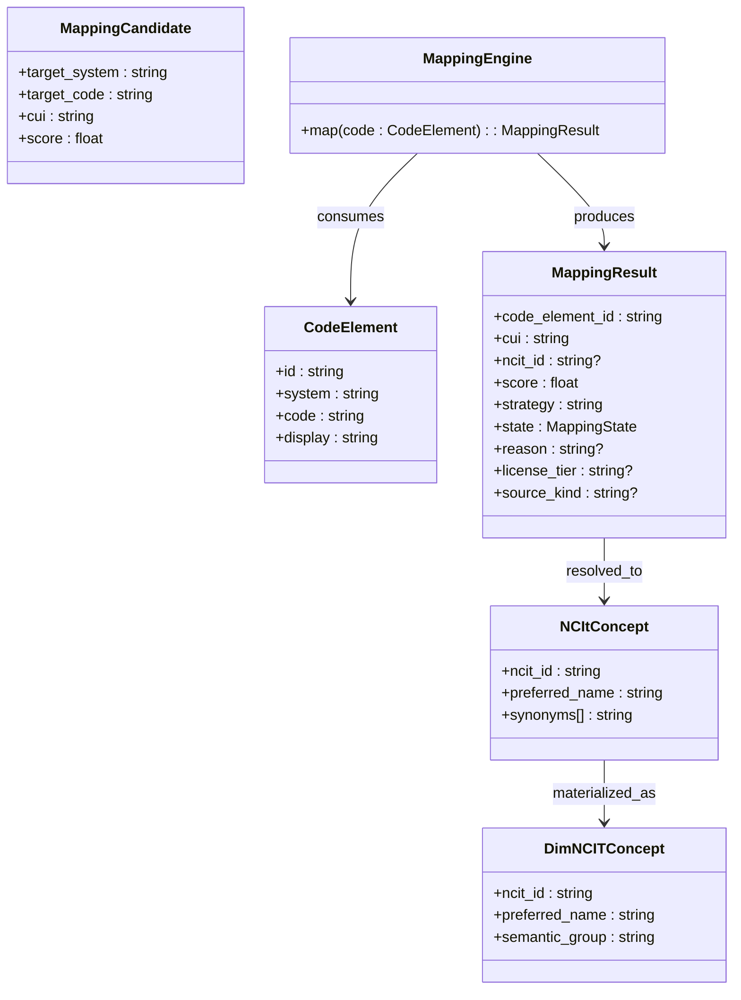

# Class view: mapping engine & NCIt concepts

Implementation notes:

- Types are implemented in `dfps_core::mapping`.
- Mapping behavior lives in `dfps_mapping::MappingEngine` with state threshold
  logic (MAP-07) and explainability helpers (MAP-11). Threshold defaults live in
  `MappingThresholds`, surfaced on every `MappingResult`.
- The end-to-end façade `dfps_pipeline::bundle_to_mapped_sr` produces the
  `MappingResult`/`DimNCITConcept` pairs used by the warehouse layer.
- When `state == NoMatch`, `reason` captures whether the engine fell below
  thresholds or lacked required identifiers. Known systems now attach license metadata for downstream policy hooks via the `license_tier` / `source_kind` fields exposed on `MappingResult`.
