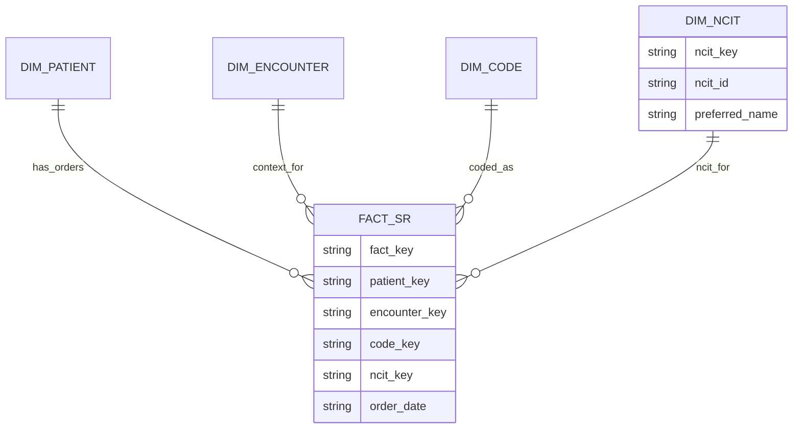

# ERD: NCIt-enhanced analytics mart

## Implementation notes

- The mart is materialized by `lib/app/web/backend/datamart` (`dfps_datamart`). Its
  `from_pipeline_output` helper ingests `dfps_pipeline::PipelineOutput` and
  produces `(Dims, Vec<FactServiceRequest>)`.
- Each dimension uses deterministic surrogate keys derived from natural
  identifiers (`patient_id`, `encounter_id`, `code_element_id`, `ncit_id`) so the
  same Bundle always yields stable FK relationships.
- `FactServiceRequest` snapshots status/intent/description plus the order
  timestamp (`ordered_at`) and always references valid dim keys. When the mapping
  engine reports `MappingState::NoMatch`, the mart links the fact to a shared
  sentinel `DimNCIT` row (`ncit_id = "NO_MATCH"`) instead of leaving `ncit_key`
  empty, keeping downstream joins simple.
