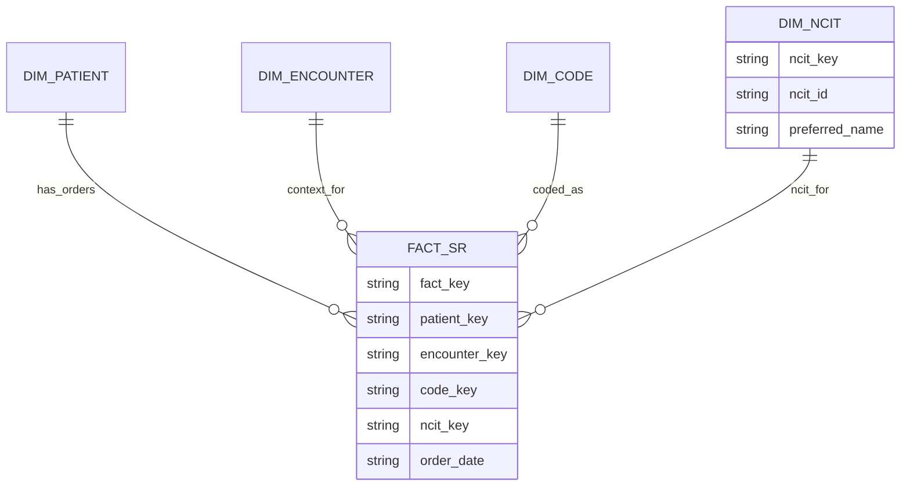

# ERD: NCIt-enhanced analytics mart

```mermaid
erDiagram
  DIM_PATIENT ||--o{ FACT_SR : has_orders
  DIM_ENCOUNTER ||--o{ FACT_SR : context_for
  DIM_CODE ||--o{ FACT_SR : coded_as
  DIM_NCIT ||--o{ FACT_SR : ncit_for

  DIM_NCIT {
    string ncit_key
    string ncit_id
    string preferred_name
  }

  FACT_SR {
    string fact_key
    string patient_key
    string encounter_key
    string code_key
    string ncit_key
    string order_date
  }
```
