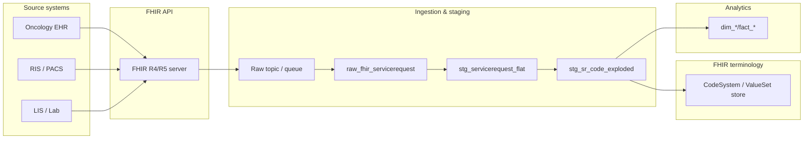

# Architecture (services & groups)

```mermaid
flowchart LR
  %% --- Source systems ---
  subgraph src[Source systems]
    ehr[Oncology EHR]
    ris[RIS / PACS]
    lis[LIS / Lab]
  end

  %% --- FHIR API layer ---
  subgraph fhir[FHIR API]
    fhir_server[FHIR R4/R5 server]
  end

  %% --- Ingestion & staging ---
  subgraph ingest[Ingestion & staging]
    raw_topic[Raw topic / queue]
    raw_store[raw_fhir_servicerequest]
    stg_sr[stg_servicerequest_flat]
    stg_codes[stg_sr_code_exploded]
  end

  %% --- Terminology ---
  subgraph term[FHIR terminology]
    cs_term[CodeSystem / ValueSet store]
  end

  %% --- Analytics / warehouse ---
  subgraph wh[Analytics]
    dw[dim_*/fact_*]
  end

  %% Edges
  ehr --> fhir_server
  ris --> fhir_server
  lis --> fhir_server

  fhir_server --> raw_topic
  raw_topic --> raw_store
  raw_store --> stg_sr
  stg_sr --> stg_codes

  stg_codes --> cs_term
  stg_codes --> dw
```

- [Index](../index.md)