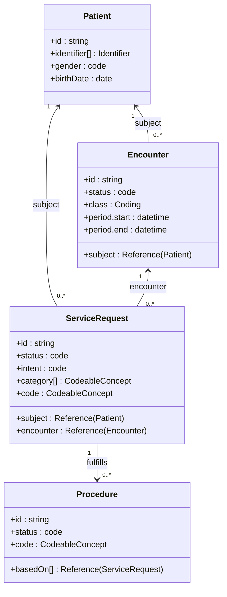

# FHIR resource relationships (logical model)

---

**Related diagrams**

- [System architecture](../architecture/system-architecture.md)
- [Ingestion ER model](./data-model-er.md)
- [ServiceRequest sequence](../behavior/sequence-servicerequest.md)
- [ServiceRequest state lifecycle](../behavior/state-servicerequest.md)
