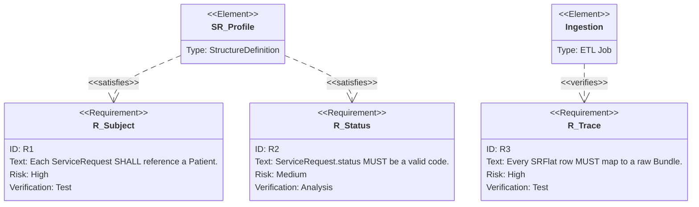

```mermaid
requirementDiagram
  requirement R_Subject {
    id: R1
    text: "Each ServiceRequest SHALL reference a Patient."
    risk: High
    verifymethod: Test
  }

  requirement R_Status {
    id: R2
    text: "ServiceRequest.status MUST be a valid code."
    risk: Medium
    verifymethod: Analysis
  }

  requirement R_Trace {
    id: R3
    text: "Every SRFlat row MUST map to a raw Bundle."
    risk: High
    verifymethod: Test
  }

  element SR_Profile {
    type: "StructureDefinition"
  }

  element Ingestion {
    type: "ETL Job"
  }

  SR_Profile - satisfies -> R_Subject
  SR_Profile - satisfies -> R_Status

  Ingestion - verifies -> R_Trace
```