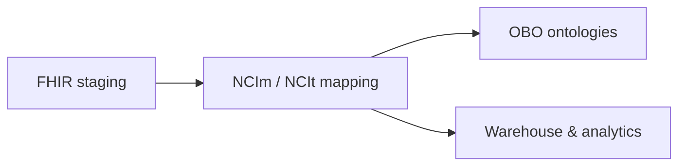

# NCIm / NCIt Mapping & Analytics Architecture

## Legend

- [Square nodes] – entities/tables
- (Rounded nodes) – services/processes
- Subgraphs – layers (Staging, Mapping, UMLS/NCIm, OBO, Warehouse)

## High-level mapping pipeline

## Architecture (mapping platform)

