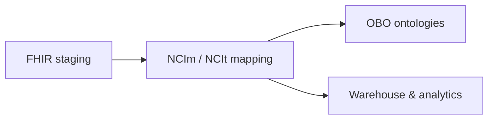
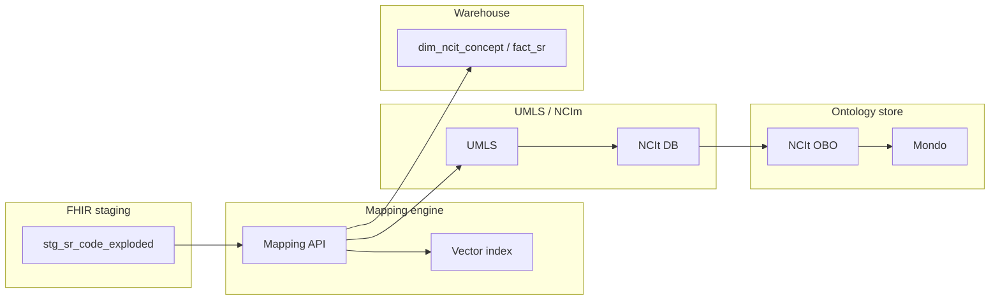

# NCIm / NCIt Mapping & Analytics Architecture

## Legend

- [Square nodes] – entities/tables
- (Rounded nodes) – services/processes
- Subgraphs – layers (Staging, Mapping, UMLS/NCIm, OBO, Warehouse)

## High-level mapping pipeline

## Architecture (mapping platform)

## Implementation references

- Rust modules: `dfps_core::mapping`, `dfps_mapping::MappingEngine`,
  `dfps_pipeline::bundle_to_mapped_sr`.
- Embedded mock vocabularies live under `lib/mapping/data/*` and are versioned
  for reproducibility.
- The `map_bundles` CLI in `dfps_pipeline` streams NDJSON Bundles through the
  staging + mapping layers for demos and smoke tests.

## Mapping states & thresholds

The mapping engine emits a `MappingResult` per `CodeElement`, annotated with
`MappingState`:

| State        | Condition                                  | Action                                         |
|--------------|--------------------------------------------|------------------------------------------------|
| AutoMapped   | Score ≥ 0.95 (default)                     | Persist & link to NCIt without manual review   |
| NeedsReview  | 0.60 ≤ score < 0.95                        | Surface to curation queue                      |
| NoMatch      | Score < 0.60 or no viable candidates found | Track for analytics; downstream defaults/nulls |

These thresholds are configurable in `dfps_mapping` (see MAP-07) and referenced
by the NCIt behavior diagrams. The explainability helpers (MAP-11) expose the
ranked candidates so reviewers can understand why a state was chosen.
