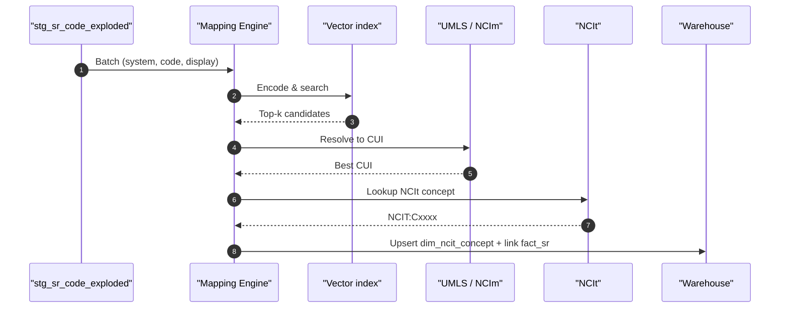

# Sequence: code → NCIt mapping → warehouse

```mermaid
sequenceDiagram
  autonumber
  participant Stg as "stg_sr_code_exploded"
  participant Engine as "Mapping Engine"
  participant Vec as "Vector index"
  participant UMLS as "UMLS / NCIm"
  participant NCIt as "NCIt"
  participant DW as "Warehouse"

  Stg->>Engine: Batch (system, code, display)
  Engine->>Vec: Encode & search
  Vec-->>Engine: Top-k candidates

  Engine->>UMLS: Resolve to CUI
  UMLS-->>Engine: Best CUI

  Engine->>NCIt: Lookup NCIt concept
  NCIt-->>Engine: NCIT:Cxxxx

  Engine->>DW: Upsert dim_ncit_concept + link fact_sr
```
