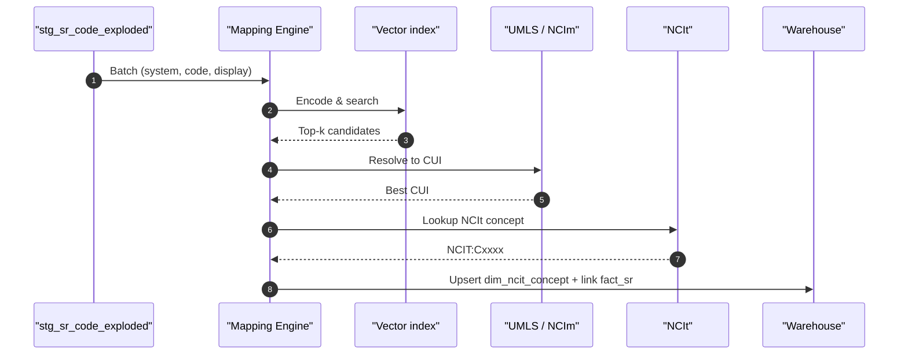

# Sequence: code → NCIt mapping → warehouse

## State transitions & modules

- `dfps_mapping::MappingEngine` executes the Engine lifeline and assigns
  `MappingState` (`AutoMapped`, `NeedsReview`, `NoMatch`) based on the thresholds
  documented in the architecture page.
- `dfps_pipeline::bundle_to_mapped_sr` provides the orchestration glue between
  staging (`dfps_ingestion`) and mapping, ensuring the sequence stays intact for
  each Bundle.
- Explainability helpers (MAP-11) expose the candidate list generated during the
  Vec/UMLS steps so reviewers can audit why a given state was produced.
