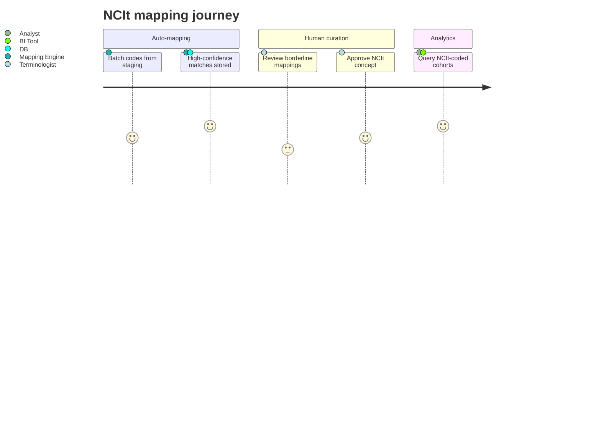

# User journey: terminology mapping & analysis

```mermaid
journey
  title NCIt mapping journey
  section Auto-mapping
    Batch codes from staging: 4: Mapping Engine
    High-confidence matches stored: 5: Mapping Engine, DB
  section Human curation
    Review borderline mappings: 3: Terminologist
    Approve NCIt concept: 4: Terminologist
  section Analytics
    Query NCIt-coded cohorts: 5: Analyst, BI Tool
```
