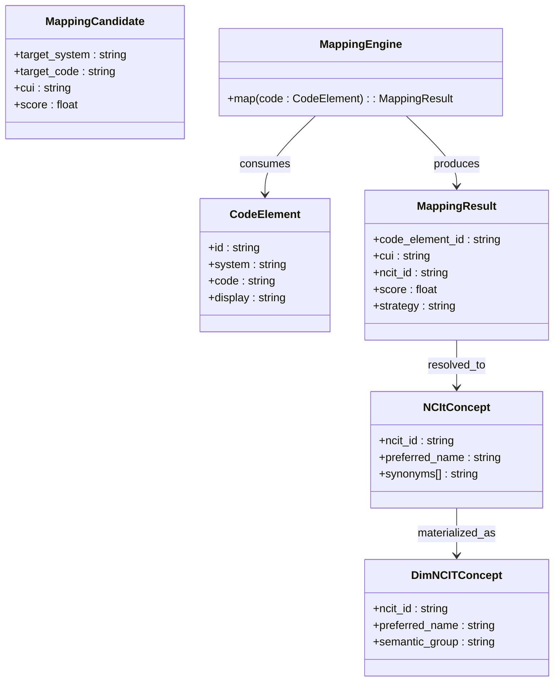

# Class view: mapping engine & NCIt concepts

```mermaid
classDiagram
  class CodeElement {
    +id : string
    +system : string
    +code : string
    +display : string
  }

  class MappingCandidate {
    +target_system : string
    +target_code : string
    +cui : string
    +score : float
  }

  class MappingResult {
    +code_element_id : string
    +cui : string
    +ncit_id : string
    +score : float
    +strategy : string
  }

  class MappingEngine {
    +map(code : CodeElement) : MappingResult
  }

  class NCItConcept {
    +ncit_id : string
    +preferred_name : string
    +synonyms[] : string
  }

  class DimNCITConcept {
    +ncit_id : string
    +preferred_name : string
    +semantic_group : string
  }

  MappingEngine --> CodeElement : consumes
  MappingEngine --> MappingResult : produces
  MappingResult --> NCItConcept : resolved_to
  NCItConcept --> DimNCITConcept : materialized_as
```
