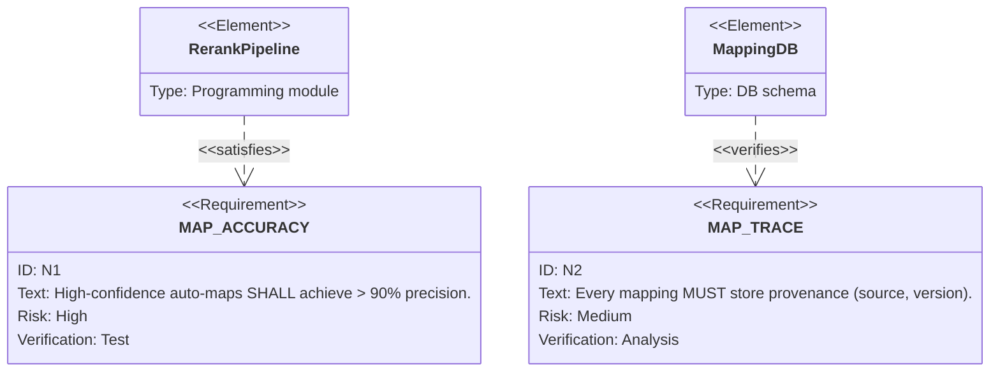

# Requirements: NCIm / NCIt mapping layer

```mermaid
requirementDiagram
  requirement MAP_ACCURACY {
    id: N1
    text: "High-confidence auto-maps SHALL achieve > 90% precision."
    risk: High
    verifymethod: Test
  }

  requirement MAP_TRACE {
    id: N2
    text: "Every mapping MUST store provenance (source, version)."
    risk: Medium
    verifymethod: Analysis
  }

  element RerankPipeline {
    type: "Programming module"
  }

  element MappingDB {
    type: "DB schema"
  }

  RerankPipeline - satisfies -> MAP_ACCURACY
  MappingDB - verifies -> MAP_TRACE
```
