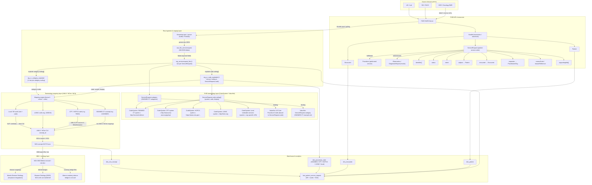

```mermaid
graph TD
  %% -----------------------------
  %% SOURCE CLINICAL SYSTEMS
  %% -----------------------------
  subgraph Source["Source clinical systems"]
    EHR["EHR / Oncology EMR"]
    RIS["RIS / PACS"]
    LIS["LIS / Lab"]
  end

  %% -----------------------------
  %% FHIR API LAYER
  %% -----------------------------
  subgraph FHIR_API["FHIR API & resources"]
    FHIRServer["FHIR R4/R5 Server"]
    Bundle["Bundle (transaction / searchset)"]

    SR["ServiceRequest (patient service order)"]
    Pat["Patient"]
    Enc["Encounter"]
    Proc["Procedure (performed service)"]
    Obs["Observation / DiagnosticReport (results)"]

    %% Key ServiceRequest fields
    SR_id["identifier[]"]
    SR_status["status"]
    SR_intent["intent"]
    SR_subject["subject → Patient"]
    SR_encounter["encounter → Encounter"]
    SR_requester["requester → Practitioner/Org"]
    SR_reason["reasonCode / reasonReference"]
    SR_support["supportingInfo[]"]
  end

  EHR -->|"REST / HL7v2 / ETL"| FHIRServer
  RIS --> FHIRServer
  LIS --> FHIRServer

  FHIRServer --> Bundle
  Bundle --> SR
  Bundle --> Pat
  Bundle --> Enc

  %% Clinical lifecycle
  SR -->|"fulfillment"| Proc
  SR -->|"ordered tests"| Obs

  %% Field fan-out
  SR --> SR_id
  SR --> SR_status
  SR --> SR_intent
  SR --> SR_subject
  SR --> SR_encounter
  SR --> SR_requester
  SR --> SR_reason
  SR --> SR_support

  %% -----------------------------
  %% RAW INGESTION & STAGING
  %% -----------------------------
  subgraph Landing["Raw ingestion & staging layer"]
    RawTopic["Streaming topic / queue (Kafka / PubSub)"]
    RawJSON["raw_fhir_servicerequest (NDJSON blobs)"]
    SRFlat["stg_servicerequest_flat (1 row per ServiceRequest)"]
    CodesExploded["stg_sr_code_exploded (1 row per coding in ServiceRequest.code)"]
    CatExploded["stg_sr_category_exploded (1 row per category coding)"]
  end

  FHIRServer -->|"Bundle push / polling"| RawTopic
  RawTopic -->|"persist raw JSON"| RawJSON
  RawJSON -->|"flatten top-level fields"| SRFlat
  SRFlat -->|"explode code.coding[]"| CodesExploded
  SRFlat -->|"explode category.coding[]"| CatExploded

  %% -----------------------------
  %% FHIR TERMINOLOGY LAYER
  %% -----------------------------
  subgraph FHIR_Term["FHIR terminology layer (CodeSystem / ValueSet)"]
    CodeElement["ServiceRequest.code.coding[] (system, code, display)"]
    Category["ServiceRequest.category (SNOMED CT categories)"]

    CS_SNOMED["CodeSystem: SNOMED CT system = http://snomed.info/sct"]
    CS_CPT["CodeSystem: CPT system = http://www.ama-assn.org/go/cpt"]
    CS_HCPCS["CodeSystem: HCPCS system = https://www.cms.gov/..."]
    CS_LOINC["CodeSystem: LOINC system = http://loinc.org"]
    CS_LOCAL["CodeSystem: Local 'orderable services' (system = org-specific URI)"]

    VS_USCoreProc["ValueSet: US Core Procedure Codes (bound to ServiceRequest.code)"]
    VS_Category["ValueSet: ServiceRequest.category (SNOMED CT example set)"]
  end

  CodesExploded --> CodeElement
  SRFlat --> Category

  CodeElement --> CS_SNOMED
  CodeElement --> CS_CPT
  CodeElement --> CS_HCPCS
  CodeElement --> CS_LOINC
  CodeElement --> CS_LOCAL

  CodeElement -->|"binding"| VS_USCoreProc
  Category -->|"binding"| VS_Category
  Category --> CS_SNOMED

  %% -----------------------------
  %% NCIt / UMLS / NCIM MAPPING
  %% -----------------------------
  subgraph NCIT_UMLS["Terminology mapping layer (UMLS / NCIm / NCIt)"]
    MapEngine["Mapping engine (lexical + vector + rules)"]
    UMLS_CUI["UMLS / NCIm CUI concept_id"]
    NCIT["NCIt concept NCIT:Cxxxx"]

    SNOMED_concept["SNOMED CT concept (e.g. 123456007)"]
    CPT_code["CPT / HCPCS code (e.g. 78815)"]
    LOINC_code["LOINC code (e.g. 24606-6)"]
    Local_code["Local 'SR code' (text + code)"]
  end

  %% Feed codes into mapping engine
  CodesExploded -->|"code, system, display"| MapEngine
  CatExploded -->|"category codes"| MapEngine
  MapEngine --> SNOMED_concept
  MapEngine --> CPT_code
  MapEngine --> LOINC_code
  MapEngine --> Local_code

  %% UMLS / NCIm hub: connect standard vocabularies to NCIt
  SNOMED_concept -->|"via UMLS / NCIm mappings"| UMLS_CUI
  CPT_code -->|"UMLS CPT source in Metathesaurus"| UMLS_CUI
  LOINC_code --> UMLS_CUI
  Local_code -->|"NLP / similarity → best CUI"| UMLS_CUI

  UMLS_CUI -->|"NCIm source = NCIt"| NCIT

  %% -----------------------------
  %% OBO / ONTOLOGY INTEGRATION
  %% -----------------------------
  subgraph OBO["OBO / ontology layer"]
    NCIT_OBO["NCIt OBO Edition ncit.owl / ncit.obo"]
    Mondo["Mondo Disease Ontology (neoplasm integrations)"]
    DOID["Disease Ontology (DOID) NCIt xrefs via hasDbXref"]
    Uberon["Uberon anatomy uberon-bridge-to-ncit.owl"]
  end

  NCIT -->|"OBO-style IRIs / ids"| NCIT_OBO
  NCIT_OBO -->|"disease mappings"| Mondo
  NCIT_OBO -->|"dbXref bridges"| DOID
  NCIT_OBO -->|"anatomy bridge files"| Uberon

  %% -----------------------------
  %% ANALYTICS / WAREHOUSE LAYER
  %% -----------------------------
  subgraph DW["Warehouse & analytics"]
    DimPatient["dim_patient"]
    DimEncounter["dim_encounter"]
    DimCode["dim_procedure_code (SNOMED / CPT / HCPCS / LOINC / local)"]
    DimNCIT["dim_ncit_concept"]
    FactSR["fact_patient_service_request (SR + codes + NCIt)"]
  end

  Pat --> DimPatient
  Enc --> DimEncounter

  CodesExploded --> DimCode
  NCIT --> DimNCIT

  SRFlat --> FactSR
  DimPatient --> FactSR
  DimEncounter --> FactSR
  DimCode --> FactSR
  DimNCIT --> FactSR
```